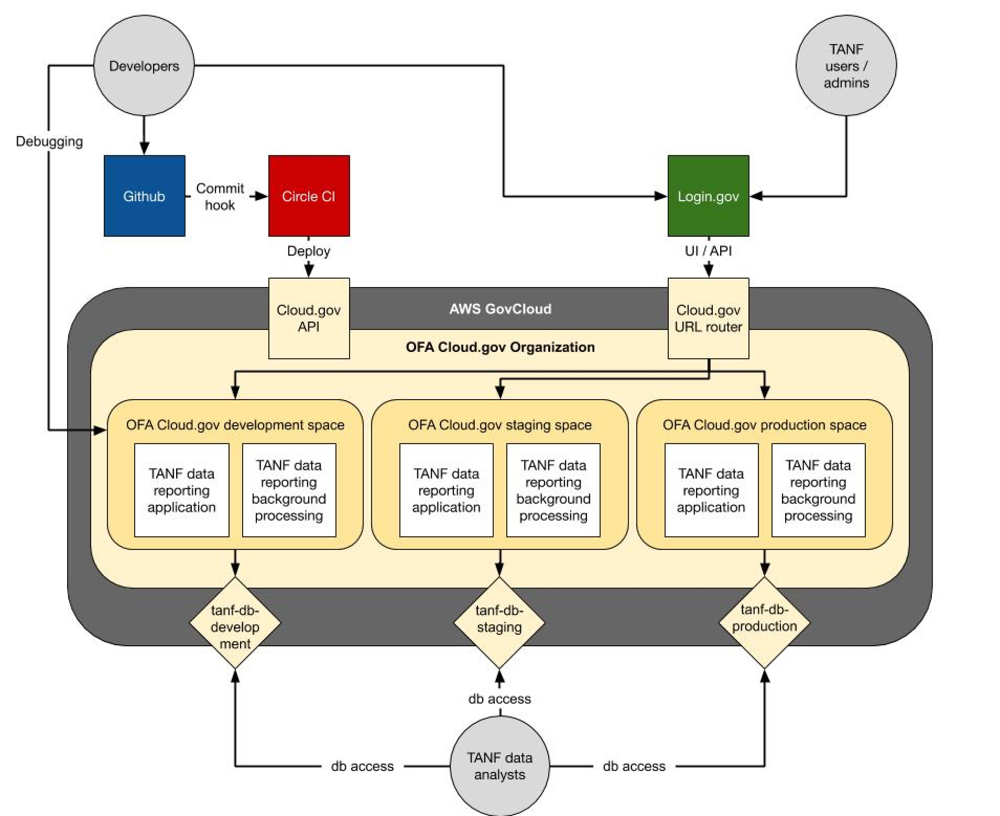

# TANF Data Reporting Prototype

This repo has a prototype for a TANF Data Reporting system, where States,
Territories, and Tribes can upload TANF data and get it validated and stored
in a database.

OFA has partnered with 18F to conduct the initial research, scoping, prototyping,
and strategy for the new TDRS. 18F has laid the groundwork for a modern and sustainable
software development process and removed as many barriers as possible for the incoming
contractor team. This information may highlight important considerations for future
development team, and should not constrain vendor’s technical approach submissions.

The [Wiki](https://github.com/hhs/TANF-app/wiki) includes more information about the vision and working commitments of the team dedicated to building a new TDRS system.

## Current TDRS information and prototype.
The current TDRS is difficult to access that 18F only leveraged the existing data format that grantees use to submit their data to TDRS and did not
develop any direct access to the system. This data format is not extensible, not
human-readable, and does not have adequate documentation. However, the data format
is standardized and does not immediately require the grantees to change their data
generation processes. Both OFA staff and grantees would like a user interface for
entering data in the new  system, but developing this will require more user research.

This TDRS prototype was built to test assumptions about the primary goal of this project.
The prototype allows users to upload data in the TANF data
reporting format and view the resulting data. It conducts limited data validation of the
submissions.  It is a Python/Django app with Login.gov integration, and running in Cloud.gov.
The OFA team uses SQL with their existing analysis tools, so 18F developed the prototype
with a Postgres SQL database. The contractor may extend, extract useful parts, or replace
the prototype application entirely.

The prototype provided an opportunity to develop an application environment. 18F and OFA
have been working together to get core technical infrastructure approved and set up so
when the contractor joins the team they can immediately begin to contribute code and have
it automatically roll out to their development environment.

The application environment is roughly: 

This infrastructure should provide OFA and the contractor with a system that will be easy to get up to speed on, manage, and use. The components are:
* [Cloud.gov](https://cloud.gov/) This is a GovCloud-based platform-as-a-service that removes almost all of the infrastructure monitoring and maintenance from the system, is already procured for OFA, and has a FedRAMP Joint Authorization Board Provisional Authority to Operate (JAB P-ATO) on file. FedRAMP is a standardized federal security assessment for cloud services, and the FedRAMP ATO helps agencies by providing confidence in the security of cloud solutions and security assessments.    Cloud.gov supports all modern software development frameworks so the contractor team does not need to continue in Python/Django if they prefer another language/framework.
* [Login.gov](https://www.login.gov/) The TDRS application requires strong multi-factor authentication for the states, tribes, and territories and Personal Identity Verification (PIV) authentication for OFA staff. Login.gov can meet both of these requirements and HHS already has an IAA for this service. Login.gov has a FedRAMP ATO on file.
* [CircleCI](https://circleci.com/) This is a CI/CD system that is commonly used by 18F. CircleCI has an FedRAMP ATO on file. It is used to automate builds, testing, and deploys from GitHub.

## How to use this prototype

This template is meant to be a starting point for the vendors.  Code that is
checked into this repo will be automatically be tested by running `./test.sh`,
and if it lives on the `dev`, `staging`, or `prod` branches, it will be deployed
to cloud.gov using the `./deploy_cloudgov.sh` script.  Thus, vendors can
immediately start writing software rather than building infrastructure.

Probably most of this documentation and application code
will be gone once the vendor gets up to speed, replaced by the documentation of
the vendor's application, it's technology, and it's processes and procedures.

* If you would like to test out how to get the prototype running locally
  or understand how the environments were set up,
  then check out [Running the TANF Data Reporting Prototype](docs/Running.md)
* Compliance documentation and information about how to approach
  the ATO process can be found in [Compliance.md](docs/Compliance.md).
* Operational procedures and workflows can be found in the 
  [Workflows documentation](docs/Workflows.md).  This is an overview of how you
  should do development using a modified gitops system, how to find logs,
  update the infrastructure, rotate secrets, etc.

 ## Public domain

This project is in the worldwide [public domain](LICENSE.md).

> This project is in the public domain within the United States, and copyright and related rights in the work worldwide are waived through the [CC0 1.0 Universal public domain dedication](https://creativecommons.org/publicdomain/zero/1.0/).
>
> All contributions to this project will be released under the CC0 dedication. By submitting a pull request, you are agreeing to comply with this waiver of copyright interest.
