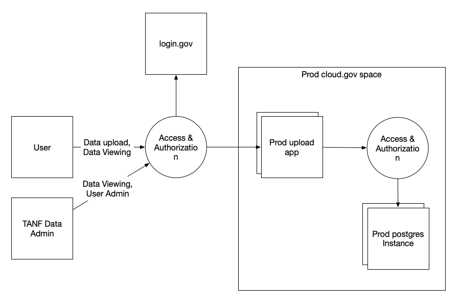
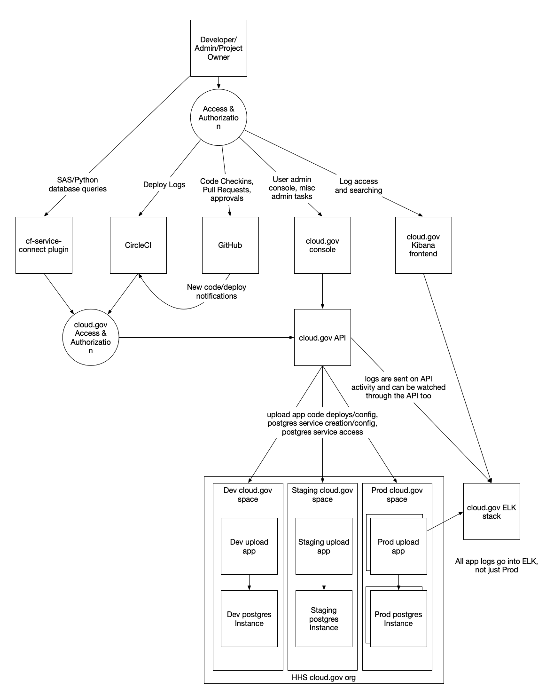

# Welcome!

This document is meant to collect most of the data that you will need to complete a
generic lightweight ATO package.  Since the documents that you must fill out are probably Word documents,
and the requirements may change over time, we believe that it would be better
for us to collect data that you need to fill out the package in a useful way
and let you consult it as you fill the actual templates out.

We have highlighted where you will probably need to edit/add data, or at
least think carefully about the contents of that section with "XXX".

# SSP Template

Most ATOs start out by working with your CISO to get an ISSO assigned to you who
can work with you on filling out your System Security Plan (SSP).  They usually
have a template which you can fill out which document some information about
your system and then documentation about a few NIST-800-53 controls which are
required to be implemented.

As you fill out sections in your agency's SSP Template, you should be able to search for
the section name to receive guidance on how to fill it out.  For many controls, you
should be able to refer your ISSO to the P-ATOs on file for cloud.gov and login.gov.

Not all sections in the SSP template will have a section here.  Those sections should
be relatively self-explanatory.

After the SSP is done, you usually submit it to the ISSO, who audits your system and gets
a third-party assessor to make sure that it looks secure through a penetration
test (pentest) and/or maybe their own audit.  After everything is done, your ATO
should be issued.  You will probably have to do periodic reviews of your ATO after
that, as well as potentially having to work with your ISSO in between reviews
if your system changes significantly in some way.

## Information System Categorization

The TANF Data Reporting System stores [PII](https://csrc.nist.gov/glossary/term/personally-identifiable-information)
for Federal Financial Assistance programs.  Because the confidentiality and integrity of the system is Moderate
(it would have a serious but not catastrophic consequence if the PII were disclosed or altered/destroyed),
and the availability is Low (if the system is down, people can wait to generate reports
or submit new data to it), the overall classification is Moderate.

## E-Authentication Determination

E-Authentication is taken care of by [login.gov](https://www.login.gov/partners/learn/), which
fulfills all of the NIST and FedRAMP requirements for identity and authentication.

## Information System Owner, Authorizing Official, Other Designated Contacts, Assignment of Security Responsibility

Some good documentation on how to understand the roles can be found in the
[18F ATO documentation](https://before-you-ship.18f.gov/ato/).

XXX  We do not know who HHS uses for these roles.

## Leveraged Provisional Authorizations

We hope to leverage a number of P-ATOs.  A good general outline for this process can be found
[here](https://cloud.gov/docs/compliance/ato-process/).

* cloud.gov:  Cloud.gov has a [FedRAMP JAB P-ATO](https://cloud.gov/docs/security/fedramp-tracker/).
  As documented on that page, you can request their fedramp P-ATO package to see details,
  as well as contact the cloud.gov team for further questions.
* login.gov:  [login.gov](https://login.gov/) also has an 
  [Agency FedRAMP P-ATO on file](https://marketplace.fedramp.gov/#/product/logingov?sort=productName).
* GitHub:  Here is [GitHub's FedRAMP package](https://marketplace.fedramp.gov/#/product/github-enterprise-cloud?sort=productName).
* CircleCI: And here is [CircleCI's FedRAMP package](https://marketplace.fedramp.gov/#/product/circleci-cloud?sort=productName).

The rest of the controls in this document are implemented by the system itself.  Leveraging
the P-ATOs here should make it much easier to get an ATO for the TANF system, since most of
the ATO documentation for the infrastructure and tooling has already been done!

## General System Description
### Information System Components and Boundaries

XXX

### Types of Users

Here are the roles that the template uses:

| Role               | Internal or External | Sensitivity/Background | Priv/Nonpriv Functions | MFA             |
|--------------------|----------------------|------------------------|------------------------|-----------------|
| Users              | External             | ???                    | Upload/view TANF Data  | Yes, login.gov             |
| Developers         | Internal             | ???                    | Edit rights to code, approval for code/deploys up to staging, SpaceDeveloper access to all spaces up to staging, SpaceAuditor access to Prod space. | Yes, GitHub 2fa |
| Admins             | Internal             | ???                    | Edit rights to code, approval for all deploys, SpaceManager access to all cloud.gov spaces. | Yes, GitHub 2fa, cloud.gov 2fa, login.gov |
| Project Owners     | Internal             | ???                    | Edit rights to code, approval for all deploys, OrgManager access to cloud.gov org. | Yes, GitHub 2fa and cloud.gov 2fa |

### Network Architecture

Information on [cloud.gov's network architecture](https://diagrams.fr.cloud.gov/10-1-network.html)
can be found in the [cloud.gov FedRAMP package](),
or on their [compliance diagram page](https://cloud.gov/docs/compliance/diagrams/#platform).

## System Environment

There are three environments by default:
* **Dev**:  The dev environment is non-HA.  Access levels are different for dev vs the other
  environments, as documented in the Types Of Users section.

  This environment is generally used by Developers to test out code.
* **Staging**:  The staging environment is non-HA.  Access
  levels are different for staging vs the other
  environments, as documented in the Types Of Users section.

  This environment is generally used to validate that code is ready for production,
  possibly with a subset of production or production-like data.
* **Production**:  The production environment is HA.  Access levels are different
  for prod vs the other environments, as documented in the Types Of Users section.

  This environment is used to serve Users.

### Hardware Inventory

You should probably put N/A here, because the hardware that you are using is covered
by [cloud.gov's FedRAMP package](https://marketplace.fedramp.gov/#/product/18f-cloudgov?sort=productName),
[GitHub's FedRAMP package](https://marketplace.fedramp.gov/#/product/github-enterprise-cloud?sort=productName)
and [CircleCI's FedRAMP package](https://marketplace.fedramp.gov/#/product/circleci-cloud?sort=productName).

All of the instances that are created/used here are managed as services within cloud.gov, GitHub, or CircleCI.
We do not maintain hosts on our own.

### Software Inventory

| Software Name            | Description | Version/Function | Virtual? | MFA? |
|--------------------------|-------------|------------------|----------|------|
| cloud.gov                |  Cloud.gov provides a Platform-as-a-Service (PaaS) based on Cloud Foundry, enabling instant provisioning of services and environments, easy deployment of applications, and rapid scaling to match demand. | Function:  Cloud Service Provider | Yes | Yes:  cloud.gov 2fa |
| GitHub Enterprise Cloud  | GitHub is a collaborative development platform. | Source code repo, change tracking/control. | Yes | Yes: GitHub 2fa |
| CircleCI Cloud           | CircleCI is a highly configurable and powerful continuous integration and delivery platform that helps software teams confidently and securely release code by automating the build, test, and deploy process. | Automate code and infrastructure deploy process | Yes | Yes:  GitHub 2fa |
| login.gov                | Login.gov offers the public secure and private online access to participating government programs. With one login.gov account, users can sign in to multiple government agencies. | Function: Secure 2fa and PIV Authentication for users | Yes | Yes:  The login.gov IDP requires 2fa/PIV |
| tanf upload              | Prototype app that lets authorized users upload TANF data files into a database and view the resulting datasets. It also lets specified administrators add and remove users.  | Django 2.2 | Yes | Yes, login.gov |

### Network Inventory

Write N/A here, because all network components are managed by cloud.gov.

### Data Flow

Here is a User data flow diagram.

Here is an Admin/Developer data flow diagram:

### Ports, Protocols, and Services

| Ports  | Protocols | Services   | Used By                          | Encrypted    |
|--------|-----------|------------|----------------------------------|--------------|
| 443    | https     | Everything | Everybody                        | Yes: TLS/SSL |

## System Interconnections and Interfaces

There are no interconnected systems.  

# Minimum Security Controls

Below here are all the security controls and their documentation.
