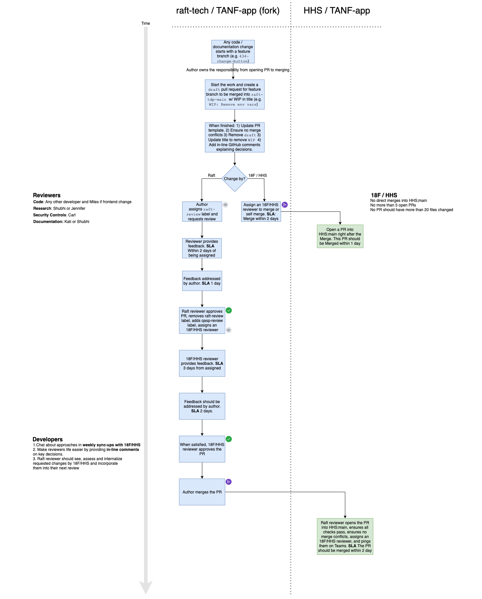

# 9. Git Workflow

Date: 2021-02-23

## Status

Pending

## Context

In order to maintain the principal of Least Privilege, it was decided at the onset of this project that the vendor (Raft) would work from a fork of the government repo and issue pull requests to the government repo from the fork. The vendor would not have write access to the government repository or the government's CircleCI account.

Throughout the project all vendor development work has been done in the vendor's forked repository, while pull requests from the government and even some documentation pull requests from the vendor were made directly to the government repository.

This has created a situation where the vendor has needed to continuously rebase with the government repository to make sure the vendor's repository was up to date. As a result, problems with the Git history have arisen that make it confusing for both the government and the vendor to track the history of the work.

The proposed workflow below provides a remedy to these issues, as well as many others, as detailed in the Consequences section.

## Decision

A contributor to the TDP project would always use the following steps to propose changes to the repository. No merges directly into `HHS:main`

1. Check out `raft-tdp-main` in `raft-tech/TANF-app` (or another branch if this work is dependent on a branch that hasn't been merged yet)
2. If working locally, run `git pull`
3. Check out new feature branch `git checkout -b <BRANCH NAME>`
4. Update the repo with code, documentation, etc.
5. If working locally, run `git push origin <BRANCH NAME>`
6. Create [a draft pull request](https://docs.github.com/en/github/collaborating-with-issues-and-pull-requests/about-pull-requests#draft-pull-requests) from new branch to `raft-tdp-main`. The PR title should include WIP e.g. `WIP: Adding a feature` (If your work is dependent on another branch that has yet to be merged, issue the pull request against that branch)
8. Implement, Test, Review work independently
9. When finished: 
    * Update the Pull Request Template
    * Add in-line comment to the file changes to provide context for the proposed changes
    * Ensure there are no merge conflicts 
    * Ensure CI/CD pipelines are green
    * Update the title to remove `WIP`, change the PR to [Ready for Review](https://docs.github.com/en/github/collaborating-with-issues-and-pull-requests/changing-the-stage-of-a-pull-request), assign label `raft-review`.
    * If your PR is against a branch other than `raft-tdp-main` keep it as a draft PR and add the tag `blocked` until the other branch is merged. 
13. Assign a reviewer: 
    * For development work, assign **at least two** Raft developers with one of them being `carltonsmith` or `jtwillis92` (**but not both**).
    * For research and design assign `shubhi-raft` and `jenewingpierce`
    * For security controls assign `carltonsmith`
    * For documentation submitted by the Government tag `lfrohlich` and `adpennington` and remove label `raft-review`
    * For documentation submissions and updates by raft assign `lfrohlich` and `adpennington` and add label `QASP review`
14. For PRs with `raft-review` label, the appropriate reviewer performs the review and/or requests changes. **GOAL** 3 days: 2 days to perform the review and 1 day to implement the requested changes. 
    * When changes are asked for, the changes are made by the contributor
15. When satisfied, the reviewer 
    * `approves` the PR
    * removes `raft-review` label
    * adds `qasp-review` label
    * assigns the Government as the reviewer:
        * For backend development work assign `alexsoble`, `adpennington` and `lfrohlich`
        * For frontend work, assign the same as backend work but also include `iamjolly` for a11y review
        * For research and design work assign `lfrohlich`
        * For security controls assign `lforhlich`
18. For PRs with `qasp-review` label, the appropriate reviewer performs the review and/or requests changes. **GOAL** 5 days: 3 days to perform the review and 2 days to implement the requested changes.
    * When changes are asked for, the changes are made by the contributor. Raft reviewers should internalize the changes asked by the Government such that the same feedback is already incorporated and/or caught in future (continuous improvement)
    * When security controls are approved, additional reviews are asked for by OCIO
19. When satisfied, the Government reviewer `approves` the PR
20. The contributor clicks Merge into `raft-tdp-main`
21. The contributor:
    * opens a PR from `raft-tdp-main` to `HHS:main`
    * Updates the PR template to change `addresses` to `closes` so that issue [can be automatically closed when the Government merges](https://docs.github.com/en/github/managing-your-work-on-github/linking-a-pull-request-to-an-issue#linking-a-pull-request-to-an-issue-using-a-keyword)
    * Ensures the CI/CD pipelines are green
    * Assigns the Government as reviewers and pings them on Teams to review/merge
26. PR is approved and merged to `HHS:main` by `adpennington` or `lfrohlich` **GOAL** 1 day from open date (by now the code is already approved by the Government)

## Consequences

**Pros**
- Dependency chains would be much easier to manage
  - We can daisy chain PRs with dependencies allowing GitHub to manage changes for downline PRs much more simply and cleanly
  - ie. `my_branch_1` depends on `my_branch_0` and there is an open PR from `my_branch_0` to `raft-tdp-main`. Can open a PR in raft-tech from `my_branch_1` to `my_branch_0` and only the changes from the latest branch will be shown to reviewers, but the dependent code will still be present and kept up to date by GitHub exposing a button to update with upstream branch
  - Because of this, we can more easily submit smaller PRs since this removes much of the maintenance work currently involved to achieve that goal
- Less complexity for developers, reviewers
- No need to rebase from `HHS:main` back to `raft-tdp-main`
- Much smaller chance of needing to revert commits to `HHS:main`
- Git history will be much cleaner
- Much less time managing git history
- All reviews will be in one place, so the entire history of a branch/PR will be viewable in one place
- Will allow us to keep the current CircleCi setup
  - Once staging is in place, we can deploy to the development server when code is merged in to `raft-tdp-main` and test deployment ahead of opening a PR to `HHS:main`
- We can implement it almost immediately
- We can implement GitHub Hooks to automatically issue PRs to `HHS:main` when one is merged to `raft-tdp-main`
- Maintain "Least Privelege" by restricting vendor from having write access to Gov repo and CircleCI
- Tests automated deployment before merging to `HHS:main`

**Cons**
- Only one pull request at a time will be able to go to `HHS:main`, but this won't be a problem since they will only be issued once approved and therefore can be merged immediately
- All PR comments will be on the vendor repo rather than the government repo

**Recommendations for how to get there**
- Merge/Close all [HHS PRs](https://github.com/HHS/TANF-app/pulls) by **figuring out when all can be merged** so that we can start with the process described above
- Do not merge anything directly to HHS:main. All PRs into HHS:main should come from raft-tech/raft-tdp-main unless absolutely needed.

## Notes
- All Pull Requests with the `QASP Review` label will be approved against the QASP Checklist
