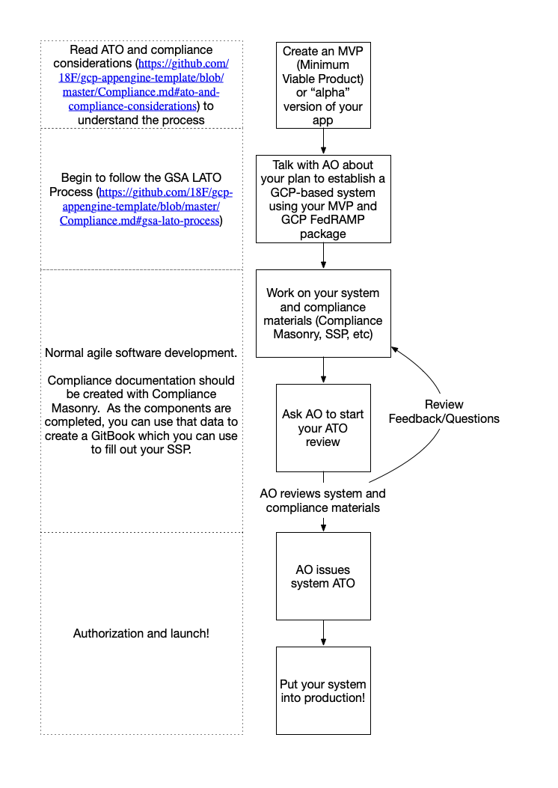

# ATO and compliance considerations

Every federal information system must be granted an Authority To Operate (ATO)
by an Authorizing Official in order to go into production.  A good overview of
the process can be found in this [excellent ATO overview](https://docs.google.com/presentation/d/1x-Bt8uyW-szHarglY57fFcC6PRCpUGFLe07uOvt93uk/edit#slide=id.g1f710bd7ce_0_847)
and a more in-depth look can be found in [18F's before-you-ship docs](https://before-you-ship.18f.gov/ato/).  There
are currently a few options for getting an ATO:
* A [FedRAMP Tailored](https://tailored.fedramp.gov/) package.
* A full [FedRAMP JAB ATO](https://www.fedramp.gov/jab-authorization/).
* A GSA LATO (Lightweight ATO), which can be found by searching for "Lightweight
  Security Authorization Guide" on 
  [this page](https://insite.gsa.gov/topics/information-technology/security-and-privacy/it-security/it-security-procedural-guides)
* Other agencies may have their own ATO process.

What ATO you get depends on what your project needs.  If you are doing this in
the GSA, you will probably want to follow the GSA LATO process, and most of the
compliance data that we have collected here is aimed at fulfilling that process.
That said, all of these ATO processes all map back to the NIST 800-53 controls,
so if you decide on a different ATO package, you ought to be able to use the
GSA LATO compliance data to help speed your ATO journey along.

## Compliance Masonry

We are using [Compliance Masonry](https://github.com/opencontrol/compliance-masonry) to
document all of the controls and how the different components satisfy them.  Every
component has a `compliance` directory which contains the documentation for that
component.  For example, the `upload` app has a
`Tanf-app/upload/compliance/component.yaml`
file, and the whole project has a `Tanf-app/compliance` directory
where everything is tied together with an `opencontrol.yaml` file, which
documents all of the components, the certifications (GSA LATO), and the
standards (NIST-800-63) that we use.  Components that do not have opencontrol
documentation are also documented in `Tanf-app/compliance/components`.

The idea is that *as you create code, you will also be creating and updating the
compliance documentation at the same time*.  You can run the `compliance-masonry diff LATO`
tool while in the `Tanf-app/compliance` directory to understand
what you still need to implement, find controls that are incomplete with
`compliance-masonry info -i partial`, etc.  Consult the 
[compliance-masonry usage docs](https://github.com/opencontrol/compliance-masonry/blob/master/docs/usage.md)
for more info.  

You can also use git tools to see what has changed between releases or
over time to see if changes are worthy of a Significant Change Request or
whatever.  For instance: `git checkout master ; git diff staging $(find . -name compliance -type d)`

Down the road, we would like to think that tools like this will evolve into
a Behaviour Driven Compliance Test suite that can actually test the implementation
of the controls described and let you know where you have gaps, but this is what
we have right now.

## Compliance Documentation

Every ATO package has a different set of documentation that it requires.  This
documentation changes over time, adding/removing controls or getting simpler or
more complex.  Most of the templates are in formats that we cannot emit or
edit in any reasonable way, so we have chosen to instead collect all the compliance
documentation you created with your code in a 
[GitBook](https://github.com/opencontrol/compliance-masonry/blob/master/docs/gitbook.md)
or a [PDF](https://github.com/opencontrol/compliance-masonry/blob/master/docs/gitbook.md#export-as-a-pdf)
that you can consult while filling out your ATO package.

## GSA LATO Process

The process that we are documenting here is aimed at getting a 
"One year Limited ATO" or "Three-year Full ATO", depending on whether your
system is classified as FIPS 199 Moderate or FIPS 199 Low.  There is also an
option to get a 90 day ATO simply by getting pentested, but after that 90 day
ATO expires, you cannot renew it, and must step up to the 1 or 3 year ATO.

Other ATO types can probably roughly follow this process and use the GSA
LATO data to fill out their SSP template.  There will probably be additional
controls that you will need to document for those, as well as different
documents to follow, different Authorizing Officials and other contacts,
etc.  You will have to figure that out.

Here is the rough idea, followed by more detailed steps:

To apply for a GSA LATO, you should:
1. Download the [Lightweight Security Authorization Guide](https://insite.gsa.gov/cdnstatic/insite/Lightweight_Security_Authorization_Process_%5BCIO_IT_Security_14-68_Rev_6%5D_04-25-2018.docx)
   from [insite](https://insite.gsa.gov/topics/information-technology/security-and-privacy/it-security/it-security-procedural-guides)
   and read it over.  This is the generic process for getting a LATO.
1. Read the 18F [Before You Ship](https://before-you-ship.18f.gov/ato/) document.
   It is much better at explaining what you should do in regular language, but
   has some cloud.gov-specific sections in it that you might need to
   work around, so keep that in mind as you follow the process.  If you are
   not in 18F, you may also have to skip some of the 18F-specific processes,
   and instead use your own local ATO-related processes.
1. Begin following the process outlined in https://before-you-ship.18f.gov/ato/.
1. When selecting controls, you will select the controls contained in Appendix B of the 
   [Lightweight Security Authorization Guide](https://insite.gsa.gov/cdnstatic/insite/Lightweight_Security_Authorization_Process_%5BCIO_IT_Security_14-68_Rev_6%5D_04-25-2018.docx).
1. When documenting the controls, be aware that much of the controls are
   [already documented](#compliance-documentation).  You will only need
   to additionally document the controls relevant to your application that
   you have deployed using this template, as well as any changes to the
   infrastructure (if any).
1. When you get to where you are filling out the [SSP](https://before-you-ship.18f.gov/ato/ssp/),
   you will want to generate the [compliance documentation](#compliance-documentation)
   from your project and use that information to help you understand what/how
   to fill out the different sections.

   A quick way to generate the [GitBook](https://github.com/opencontrol/compliance-masonry/blob/master/docs/gitbook.md)
   that lets you see the controls and other compliance information is:
   1. Make sure you have [Docker Desktop](https://www.docker.com/products/docker-desktop)
      installed.
   1. `cd Tanf-app && ./generate-compliance-gitbook.sh`
   1. open `Tanf-app/compliance/exports/pdf/tanf_compliance.pdf`
      in your favorite PDF viewer.

   Most of the sections in the [SSP Template](https://docs.google.com/document/d/1ye-MUIq_0cmv8-Lkd41Gx_V0adIiLEho96GwYI_H_8g/edit#heading=h.nc0r2rvqrwc4)
   (which you can find in Appendix A of the [Lightweight Security Authorization Guide](https://insite.gsa.gov/cdnstatic/insite/Lightweight_Security_Authorization_Process_%5BCIO_IT_Security_14-68_Rev_6%5D_04-25-2018.docx))
   will have some text in the [GitBook](https://github.com/opencontrol/compliance-masonry/blob/master/docs/gitbook.md)
   that you can copy or use as a guide to fill out the various sections
   and controls, in addition to the more general guidance in the
   [SSP documentation](https://before-you-ship.18f.gov/ato/ssp/).
1. Continue executing the process outlined in the 18F [Before You Ship](https://before-you-ship.18f.gov/ato/)
   document until you have your ATO!

## Continuing Maintenance of GSA LATO

You may need to re-authorize your ATO if you make significant changes to
the system, especially if they change the security posture of the system.
You will also need to renew your ATO once a year.

These processes are also documented at a high level in the
18F [Before You Ship](https://before-you-ship.18f.gov/ato/) document.
