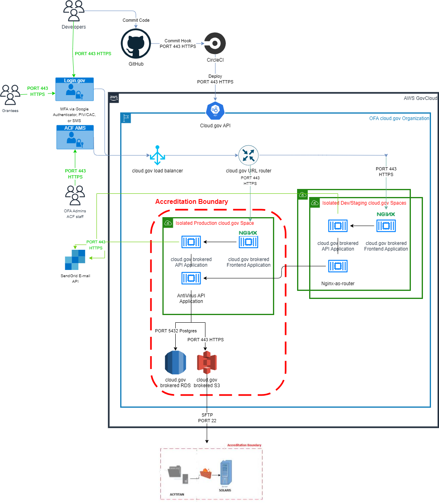

# Boundary diagram with file transfer from TDP to TDRS

The [TDP boundary diagram](../boundary-diagram.md) has been _temporarily_ modified herein to reflect updates to the data flow. 

### Updated Data flow

Data files from grantees will, for the most part, follow the original flow:
- users with `OFA Admin` and (STT) `Data Analyst` roles will upload and submit files via the web application 
- upon submission, files will be scanned for viruses via ClamAV. Infected files will be discarded, and clean files will be stored in cloud.gov AWS S3 buckets. 

#### _What's new?_
Files stored in cloud.gov's encrypted AWS S3 buckets will be transferred via SFTP to the ACFTitan server, which lives within the legacy system's (TDRS) ATO boundary diagram, as shown below. A more complete visual of the TDRS architecture and ATO boundary can be found [here](https://hhsgov.sharepoint.com/sites/TANFDataPortalOFA-TestPrivateChannel/Shared%20Documents/Forms/AllItems.aspx?id=%2Fsites%2FTANFDataPortalOFA%2DTestPrivateChannel%2FShared%20Documents%2FTest%20Private%20Channel%2FExamples%2FTDRS%2FBoundary%20Diagram%2FTANF%20Network%20Diagram%2EJPG&parent=%2Fsites%2FTANFDataPortalOFA%2DTestPrivateChannel%2FShared%20Documents%2FTest%20Private%20Channel%2FExamples%2FTDRS%2FBoundary%20Diagram) :lock:. 

These files will be picked up by the ACF OCIO Ops team, who maintain TDRS, for data processing and dB storage. This transfer process is temporary until TDP reaches parity with TDRS in terms of data processing, validation, and dB storage. More background on TDRS functionality can be found [here](../../Background/Current-TDRS.md)

## Updating

- Download latest version pdf diagram [draw.io](diagram.drawio)
- Edit this diagram with [draw.io](https://app.diagrams.net/)
- Update the image and point download link to correct file
