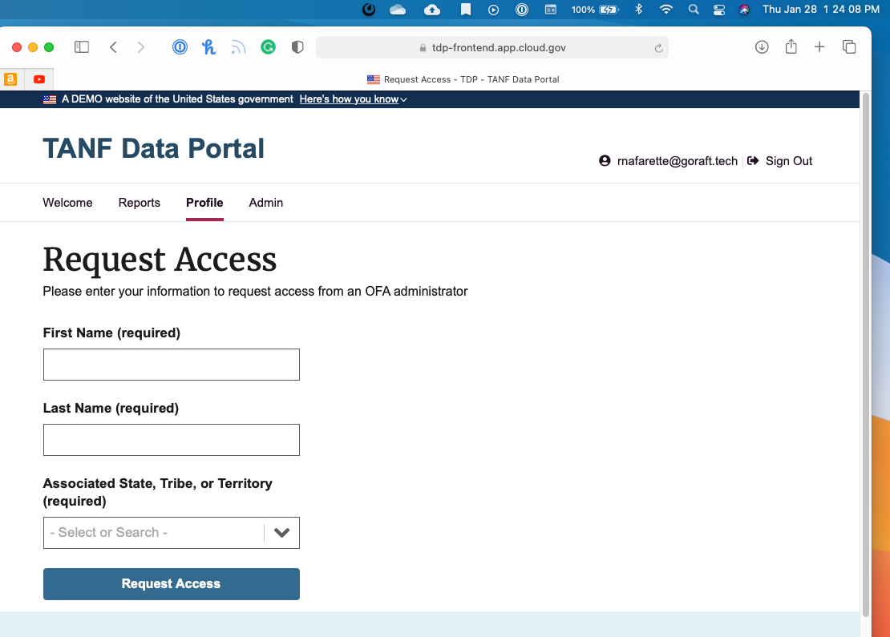
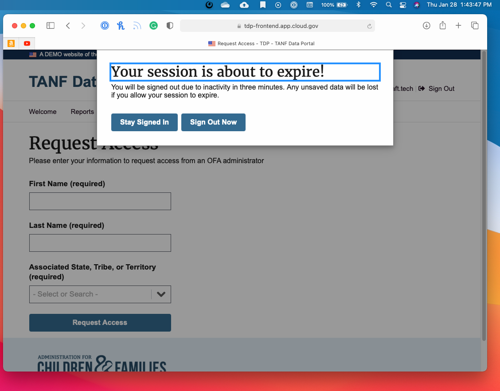

# Access Control

## AC-02(05) - ACCOUNT MANAGEMENT | INACTIVITY LOGOUT

The organization requires that users log out when [Assignment: organization-defined time-period of expected inactivity or description of when to log out].

AC-2 (5) Additional FedRAMP Requirements and Guidance:  
Guidance: Should use a shorter timeframe than AC-12

### TDP Implementation

TDP is configured to log out users out after 30 minutes of inactivity.

If there has been 20 minutes of inactivity, TDP will alert the user that the session will time out soon and give them the option to either extend the session or logout of the system. If the user chooses to extend the session, TDP will refresh the session. If the user elects to log out of the system it will end the session and log the user out of the system. The user will have three (3) minutes to select an option. If no option is selected within the three (3) minutes, the user is automatically logged out of the system and returned to the TDP home page.

#### Related Files

[Session Management Implementation Description](../../tdrs-backend/docs/session-management.md)

Screenshots:  

