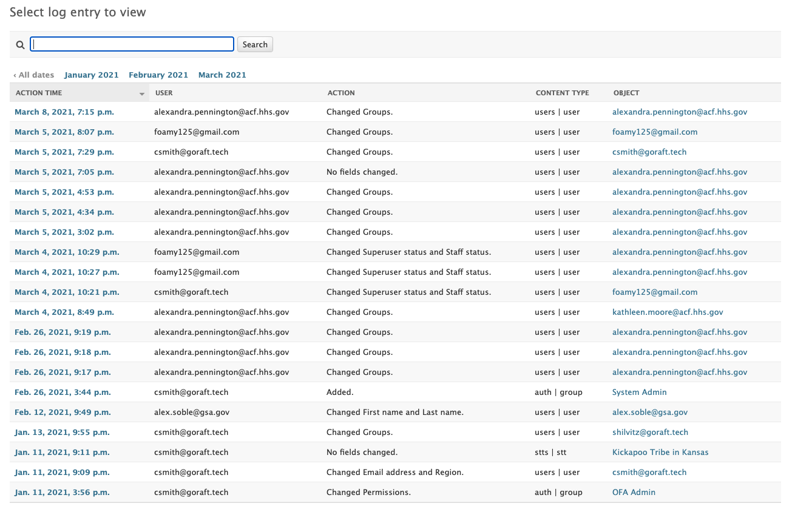

# Audit and Accountability  
## AU-02 - Audit Events  

The organization:  
a. Determines that the information system is capable of auditing the following events:  

	i. The following events must be identified within server audit logs:  
		- Server startup and shutdown;  
		- Loading and unloading of services;  
		- Installation and removal of software;  
		- System alerts and error messages;  
		- User logon and logoff;  
		- System administration activities;  
		- Accesses to sensitive information, files, and systems  
		- Account creation, modification, or deletion;  
		- Modifications of privileges and access controls; and,  
		- Additional security-related events, as required by the System Owner (SO) or to support the nature of the supported business and applications.  

	ii. The following events must be identified within application and database audit logs:  
		- Modifications to the application;  
		- Application alerts and error messages;  
		- User logon and logoff;  
		- System administration activities;  
		- Accesses to information and files  
		- Account creation, modification, or deletion; and,  
		- Modifications of privileges and access controls.  

	iii. The following events must be identified within network device (e.g., router, firewall, switch, wireless access point) audit logs:  
		- Device startup and shutdown;  
		- Administrator logon and logoff;  
		- Configuration changes;  
		- Account creation, modification, or deletion;  
		- Modifications of privileges and access controls; and,  
		- System alerts and error messages.];  

b. Coordinates the security audit function with other organizational entities requiring audit-related information to enhance mutual support and to help guide the selection of auditable events;  

c. Provides a rationale for why the auditable events are deemed to be adequate to support after-the-fact investigations of security incidents; and  

d. Determines that the following events are to be audited within the information system: [Unsuccessful log-on attempts that result in a locked account/node;  Configuration changes;  Application alerts and error messages; System administration activities; Modification of privileges and access; and Account creation, modification, or deletion].  

**For CSP Only**  
AU-2 (a) [Successful and unsuccessful account logon events, account management events, object access, policy change, privilege functions, process tracking, and system events For Web applications: all administrator activity, authentication checks, authorization checks, data deletions, data access, data changes, and permission changes]
AU-2 (d) [organization-defined subset of the auditable events defined in AU-2 a to be audited continually for each identified event]  

AU-2 Additional FedRAMP Requirements and Guidance:   
Requirement: Coordination between service provider and consumer shall be documented and accepted by the JAB/AO.  

## TDP Implementation  

The TDP system inherits audit tools and capabilities from Cloud.gov and login.gov to audit the logs of Developer and TDP user account actions, respectively.  Additionally, Django Admin provides logs of user actions that can be monitored and reviewed.

a.i The following events must be identified within server audit logs:
- a.i.1 | *inherited from Cloud.gov*
- a.i.2 | *inherited from Cloud.gov*
- a.i.3 | *inherited from Cloud.gov*
- a.i.4 | *inherited from Cloud.gov*
- a.i.5 | *inherited from Login.gov*
- a.i.6 | *inherited from Cloud.gov*
- a.i.7 | Access logged in Cloud.gov and activity logged in Django Admin
- a.i.8 | Account creation through Login.gov, modification and deletion logged in Django Admin
- a.i.9 | Logged in Django Admin
- a.i.10 | Uploading and downloading of data files is logged to Cloud.gov system logs

a.ii The following events must be identified within application and database audit logs: 
- a.ii.1 | Modifications to the application are tracked in the open source repository hosted on GitHub.com
- a.ii.2 | Frontend alerts and errors send a logging message to the backend to log to the server. Backend errors are logged to the server.
- a.ii.3 | *inherited from Login.gov*
- a.ii.4 | Logged in Django Admin
- a.ii.5 | Access is logged through the backend
- a.ii.6 | Account creation is inherited from Login.gov. Account modification and deletion is logged in Django Admin.
- a.ii.7 | Logged in Django Admin

a.iii The following events must be identified within network device (e.g., router, firewall, switch, wireless access point) audit logs:
- All are inherited from Cloud.gov

b. Inherited from Cloud.gov

c. Inherited from Cloud.gov

d.
- Login lockouts are inherited from Login.gov
- Configuration changes are inherited from Cloud.gov
- Application alerts and error messages are logged to server logs.
- System Administration activities are logged in Django Admin
- Modifications of privileges and access are logged in Django Admin
- Account creation is inherited from Login.gov
- Account modification and deletion is logged in Django Admin

#### Related Files  

Django Admin Logging Example

