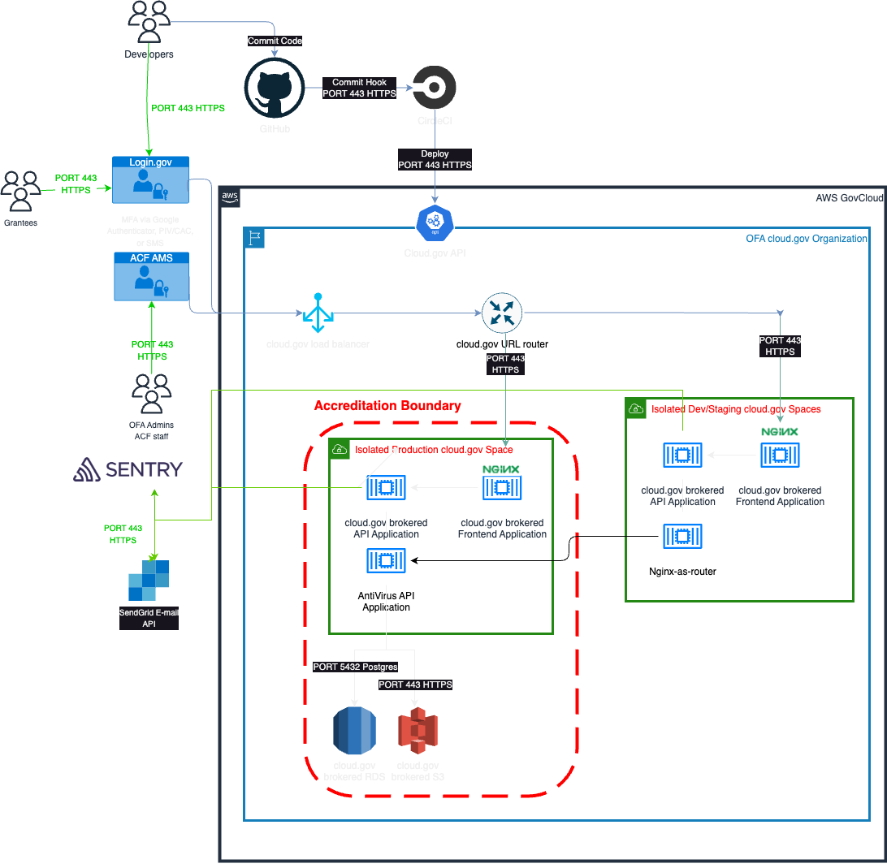

# Boundary diagram

## Description

### Data flow

Users with `OFA Admin` and (STT) `Data Analyst` roles can upload data on upload data files locally into the web application which will store the files in cloud.gov AWS S3 buckets only after the files are successfully scanned for viruses via [ClamAV](../Technical-Documentation/Architecture-Decision-Record/012-antivirus-strategy.md). Developers will deploy new code through GitHub, initiating the continuous integration process through Circle CI.

### Environments/Spaces

[Production, Staging, and Dev spaces](../Technical-Documentation/diagrams/tdp-environments.png) provide users with access to a shared location for app development, deployment, and maintenance. The frontend and backend application in each environment is scoped to a space. Roles provide access control for these resources and each space role applies only to a particular space. Developer access to the Dev space does not permit access to Production. Development and Staging environments will not contain any PII.

### User access

All web users will log into the system through their web browsers. 
- all non-acf users will leverage Login.gov and two factor authentication.
- all ACF users will leverage ACF AMS and authenticate using PIV/CAC.  Developers will also have access to the `dev` and `staging` spaces using SSH.

All users will be required to be approved within the application by an administrator.

### Access points

Beyond web-based authentication through ACF AMS or Login.gov, and developer SSH access to the dev Space, CircleCI will also have access to the various environments to support deployments.

TDP system administrators will trigger CircleCI-based deployments via GitHub. 

### Configuration

Application configuration will be handled by environment variables stored securely within cloud.gov.

## Updating

- Download latest version pdf diagram [draw.io](diagram.drawio)
- Edit this diagram with [draw.io](https://app.diagrams.net/)
- Update the image and point download link to correct file
