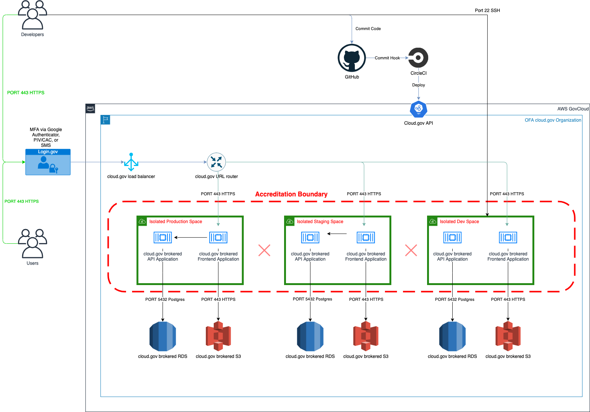

# Boundary diagram

[Download file](diagram-2020-12-17.drawio)

## Description
### Data flow
For the MVP, OFA admins will upload data on behalf of STTs and upload data files locally into the web application which will store the files in cloud.gov AWS S3 buckets. Developers will deploy new code through GitHub, initiating the continuous integration process through Circle CI.

### Environments/Spaces
Production, Staging, and Dev spaces provide users with access to a shared location for app development, deployment, and maintenance. The frontend and backend application in each environment is scoped to a space. Roles provide access control for these resources and each space role applies only to a particular space. Developer access to the Dev space does not permit access to Staging and Production.

### User access
All web users, including OFA admins will log into the system through their web browsers using Login.gov and two factor authentication. Developers will also have access to the Dev Space using SSH. STT users will be required to be approved within the application by an administrator.

### Access points
Beyond web based authentication through Login.gov, and developer SSH access to the Dev Space, CircleCI will also have access to the various environments to support deployments.

### Configuration
Application configuration will be handled by environment variables stored securely within cloud.gov.

## Updating
* Edit this diagram with [draw.io](https://app.diagrams.net/)
* Update the image and point download link to correct file
