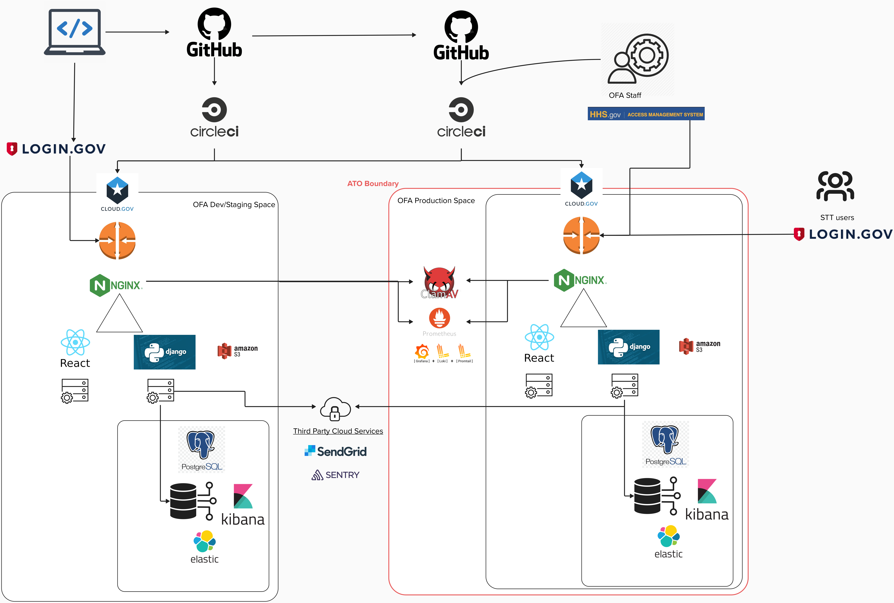

# 22. Monitoring Application Health and Performance

Date: 2024-09-30

## Status

Pending

## Context
Historic feedback highlighted an ongoing desire for improved alerting and monitoring mechanisms, particularly originating in issue [#831](https://github.com/raft-tech/TANF-app/issues/831) circa 2021. Currently, our cloud platform has limited logging features and user interface issues leading to a "blindness" to errors and stack traces that have occurred, ultimately impairing our ability to maintain system stability; additionally, the existing dashboards only offer live performance data lacking data over time or any archives. Without context for either performance or system logging, determination of anomalous or erroneous system behavior is not possible.

Additionally, we have experienced critical blocking issues related to our updates to both Elasticsearch (ES) and PostgreSQL, which have compounded the need for more proactive alerting and load-testing in lower environments. Without timely notifications, we risk delays in addressing failures that could escalate into more significant problems.

## Decision
We will build out a suite of tools in accordance with industry best practices to monitor our applications. Implementing a comprehensive monitoring and alerting ecosystem will not only help in identifying errors in real-time but also enable us to establish benchmarks based on historical data. This approach will foster a more proactive response strategy, ensuring that potential issues are mitigated before they impact our users or that system owners and system admins are aware of issues that have impacted users.

Cloud Environments Workflow

### Why Sentry
Sentry captures unhandled exceptions and incorporates detail context about exceptions including error messages, stack traces, affected URLs and user data information. Such information is essential in demystifying the cause of error.

Additionally, as can be seen in the image below, the following information is available:

- Frequency: shows the frequency detail of error
- Timeline: when has the error happened in a period
- Can create a ticket and assign automatically
- Variables at each step of stack trace. This is very important for debugging

Issues with filter enabled

Detail exceptions

Full stack trace of the exceptions

Performance monitoring in Sentry can greatly enhance the backend application by providing real-time insights into how the TANF app is performing. Sentry tracks various metrics such as response time, database queries, and external API calls. These metrics will help identify performance bottlenecks associated to the backend app.

A unique ability of Sentry is that it links performance issues and groups them together. This gives us the ability to visualize areas that consistently have poor performance. Allowing us to swarm and resolve the most frequent offenders that have the highest impact. Sentry also detects issues with web transactions, database queries, and function regressions (if the duration of function has increased).

### Why Prometheus-Loki-Grafana

Grafana shall provide a visualization dashboard for these various tools which will collect and aggregate performance metrics, system logs, and allow deeper analysis for all aspects of our systems: frontend, proxies, backend, databases, and even networking. Additionally, the development team will seek to hone a proactive alerting system for out-of-threshold issues and errors for improved visibility of system issues.

The storing of system logs will allow more expedient troubleshooting and debugging that is currently out of reach with Cloud.gov's existing Kibana interface for logging. The ability to find and correlate log events is critical to technical analysis of faults, performance degradation, and system's overall health.

By having our monitoring ecosystem take in performance metrics, we will garner performance metrics over time as opposed to simply a live snapshot as is currently provided. This will allow spotting of anomolous or out-of-bounds behaviors such as out of memory, high memory, cpu spikes, and disk thrashing.

Finally, having all of this data in one place will allow technical staff to easily cross-reference given time periods with problematic performance, ongoing issues, or error stacktraces leading to a holistic view of all of our applications both in lower tier development sites and in critical production.

## Consequences

* Increased platform costs for running these tools
* Time and effort maintaining and configuring these new systems
* "Noisy" notifications from from out-of-tune alerting
* Efforts made towards security compliance as these systems have intimate access to our systems and data
* Learning curve for technical staff

## Notes
Given the prohibitive costs of self-hosting Sentry in Cloud.gov, we propose using Sentry's Cloud SaaS offering which will alter the [boundary diagram](../../Security-Compliance/diagram.png). The other tools in use (PLG stack and associated), will be self-hosted and maintained by the technical staff both at Raft and OFA.