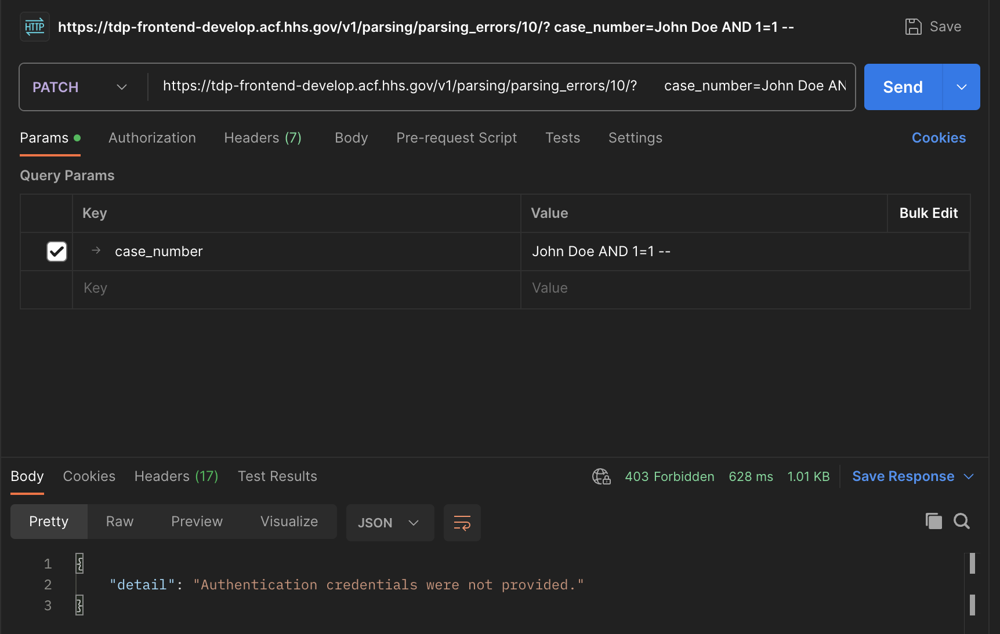
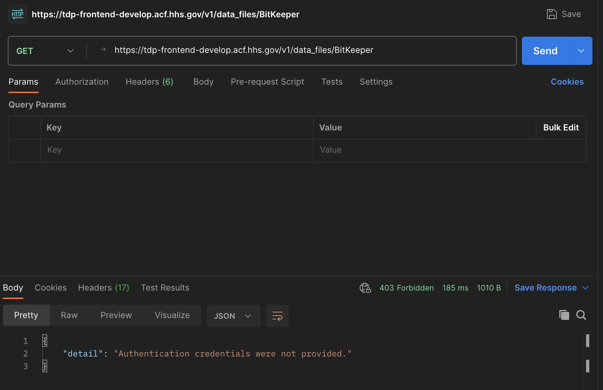

# OWASP Zap Scan HTML Report

We have added a feature to the CI/CD which produces a report in HTML for the OWASP Zap scan. 
This will make it much easier to review the results of these scans. This document shows how
to access the report.

### Accessing the HTML Report

1. When a pull request is issued, the CI/CD checks automatically kick off. Go to the bottom of the

Conversation screen to see the checks running.


2. To the right of either `ci/circleci: test-backend` or `ci/circleci: test-backend` click the `Details` 
link to view the running process at CircleCI


3. Click the `Artifacts` tab at the top of the screen once the process has completed.


4. Click the `owasp_report.html` link to view the report.


### Configuring Report Output

We use separate files for configuring the ZAP scanner for the front and back end applications
Backend:    [tdrs-backend/reports/zap.conf](../../tdrs-backend/reports/zap.conf)
Frontend:   [tdrs-frontend/reports/zap.conf](../../tdrs-frontend/reports/zap.conf)

These files have a list of error codes and what to do with them. We have some of these set 
to IGNORE because they do not apply to our configuration but were returning false positives
for test failures. For each of these, we should have a comment as to why the test is being
ignored.

Can use Postman to mimic the test parameters before ignoring to verify
The [free version of Postman](https://www.postman.com/downloads/), the app or web version, can be used for this.
examples:



### Invoking the OWASP Zap Scanner

We build out how we invoke the zap scanner using our [zap-scanner](../../scripts/zap-scanner.sh) script.

As part of that, we pass some additional configuration that includes a list of urls to exclude from the 
scan.
`ZAP_CLI_OPTIONS` contains this list.
It is important to note, not to include the frontend or backend endpoint we want to test the scanner out
on. 

e.g. do not include something like this in the `-config globalexcludeurl.url_list.url` configuration options:
```
  -config globalexcludeurl.url_list.url\(3\).regex='^https?://.*\.hhs.gov\/.*$' \
  -config globalexcludeurl.url_list.url\(3\).description='Site - acf.hhs.gov' \
  -config globalexcludeurl.url_list.url\(3\).enabled=true \
```

It will not be able to find the endpoint for the tests and the output is confusing as to what is happening. 
