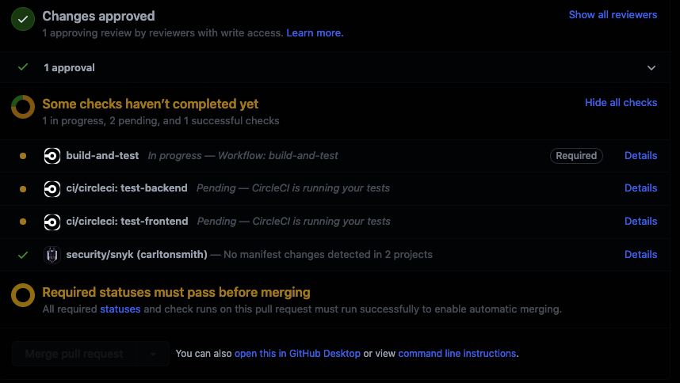
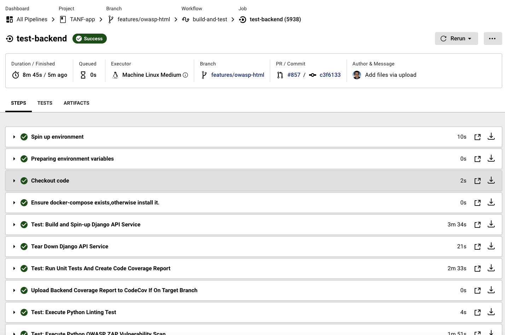
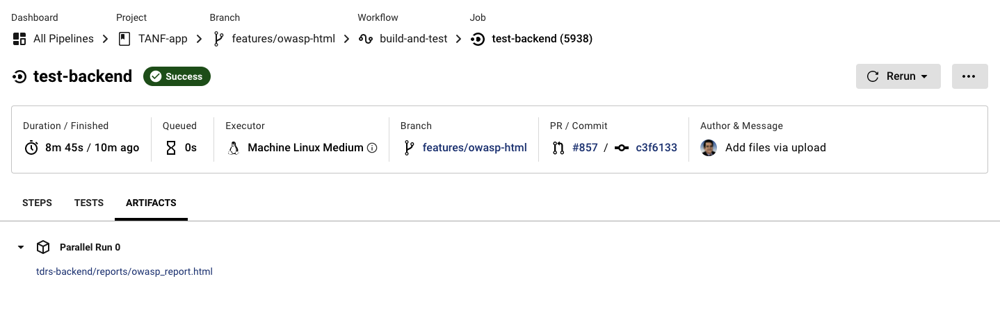
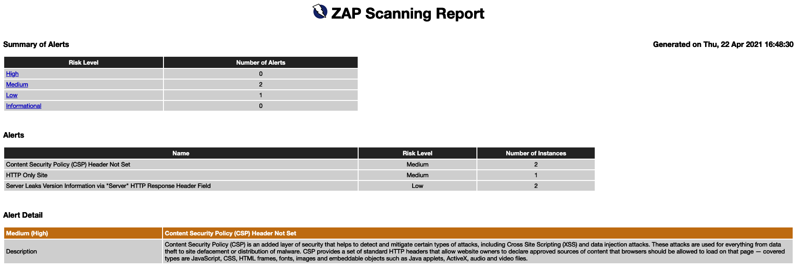

# OWASP Zap Scan HTML Report

We have added a feature to the CI/CD which produces a report in HTML for the OWASP Zap scan. 
This will make it much easier to review the results of these scans. This document shows how
to access the report.

### Accessing the HTML Report

1. When a pull request is issued, the CI/CD checks automatically kick off. Go to the bottom of the

Conversation screen to see the checks running.

2. To the right of either `ci/circleci: test-backend` or `ci/circleci: test-backend` click the `Details` 
link to view the running process at CircleCI

3. Click the `Artifacts` tab at the top of the screen once the process has completed.

4. Click the `owasp_report.html` link to view the report.

