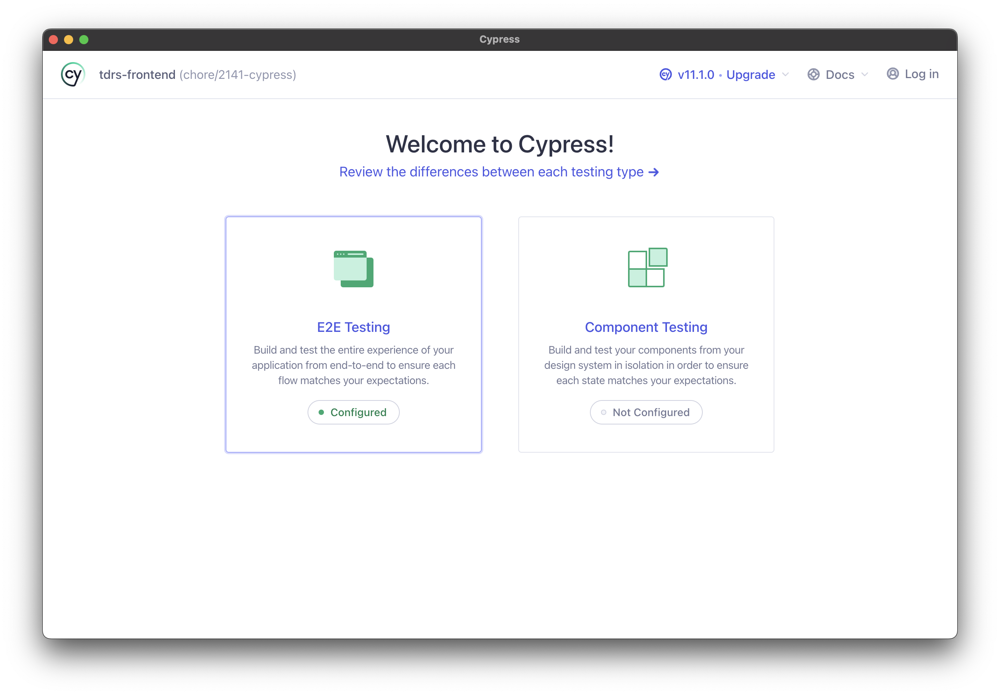
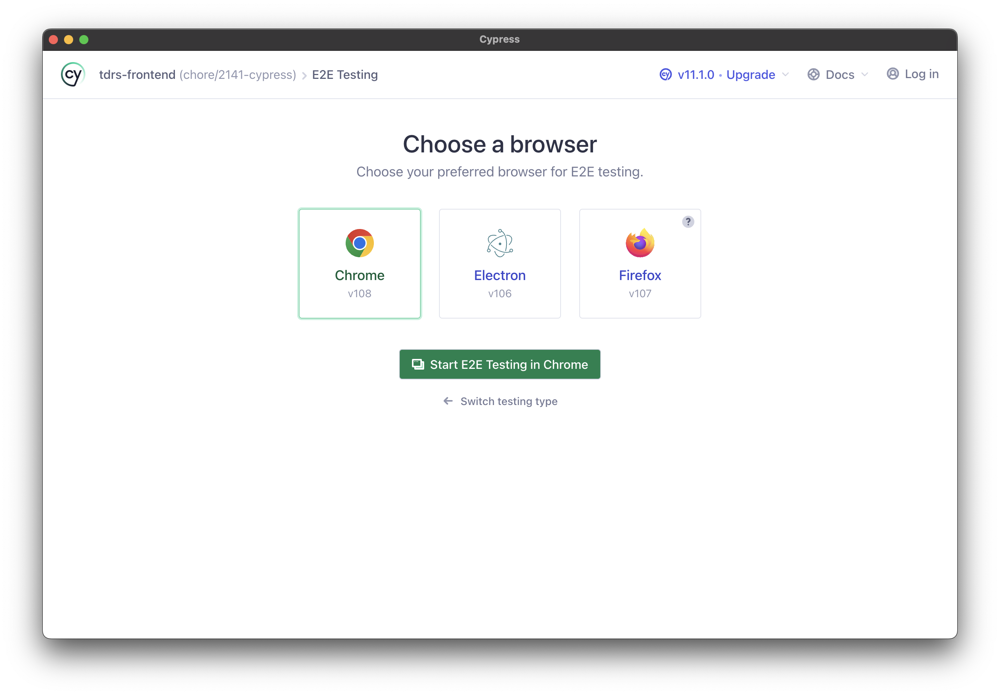
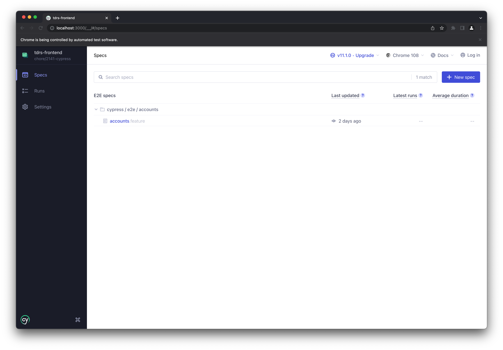
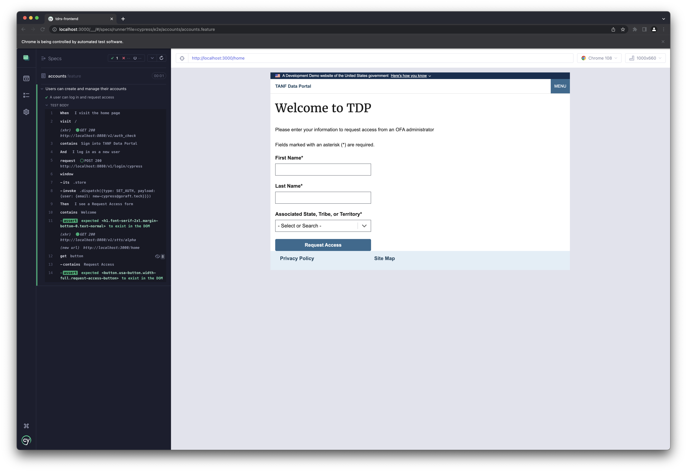

# Cypress integration testing

## Background

[Cypress](https://cypress.io) is a browser-automation testing suite that we use for end-to-end tests. See (ADR019 - Integration Tests)[./Architecture-Decision-Record/019-integration-tests.md] for some additional background on testing goals and decisions.

## Running tests

1. Have both the backend and frontend running in separate terminal processes, the app needs to be reachable and usable at `localhost:3000` when testing locally
1. In a new terminal, set up test users by running
   ```bash
   cd tdrs-backend
   docker-compose exec web python manage.py generate_cypress_users
   ```
1. Be sure your `tdrs-backend/.env` file contains the following
   ```bash
   # testing
   CYPRESS_TOKEN=anything-will-do # this should match the value in `tdrs-frontend/cypress.config.js`

   DJANGO_DEBUG=yes
   ```
1. In a new terminal, run the following commands to launch the Cypress runner
   ```bash
   cd tdrs-frontend
   npm run test:e2e
   ```
1. Select "E2E Testing" from the testing type menu
   
1. Select a browser and click "Start E2E Testing"
   
1. Now you can select a spec file from the menu and watch the tests run
   
   

## Using the Cypress runner

It is highly recommended that you check out the [Cypress Test Runner](https://docs.cypress.io/guides/core-concepts/cypress-app#The-Test-Runner) feature overview. Here are the main highlights

* Command log - Cypress will show you each `cy` command that executes in the command log, alongside the rendered page. 
   * You can hover over past commands to "time travel" and replay individual steps, and clicking on a command in the log will "pin" the point in time in the runner, and log output information about that command in the console.
   * The command log also shows network requests and other dispatched events.
* Dev tools - you can open up chrome's devtools (right click and click "Inspect") and see all the normal DOM information about the page, including for pinned commands which is useful when debugging. The console will also show output from the page as well as the tests.
* Automatic rerun - whenever you save your test code or frontend app code, Cypress automatically reruns the open test.

## Writing tests

On top of Cypress, we've layered `cypress-cucumber-preprocessor` to provide [Gherkin](https://cucumber.io/docs/gherkin/reference/) syntax for tests. This gives the tests more structure and allows us to easily separate and organize step implementations.

Test files are defined as `.feature` files within the `tdrs-frontend/cypress/e2e` directory. Feature "areas" can be grouped into a folder.

Step implementations are defined as `.js` files within the `tdrs-frontend/cypress/e2e` directory. A `.feature` file will load any `.js` files in its same directory.

Here's an example feature file

`tdrs-frontend/cypress/e2e/accounts/accounts.feature`
```gherkin
Feature: Users can create and manage their accounts
    Scenario: A user can log in and request access
        When I visit the home page
        And I log in as a new user
        Then I see a Request Access form
```

At its top level, it defines a `Feature` with multiple `Scenarios` (this can be likened to a `describe` and `it` in jest, respectively). Scenarios belonging to a feature area should be grouped within a Feature. Scenarios should describe a specific task/goal the user is required to perform in the system.

Each line within a `Scenario` is a "step", which should describe the user interaction with the system in the business context. There are three types of steps, `Given`, `When`, and `Then`
* `Given` steps define prerequisite state of the system in order for the tests to run. Mostly commonly, we'll use a `Given I am logged in as xyz` step to perform user login and setup prior to the test steps actually executing.
* `When` steps define user actions needed to perform the task.
* `Then` steps describe validation or confirmationt that the user receives, indicating success of the task.

In general, all `Given`, `When`, and `Then` steps should reflect things the _user_ of the system knows about the system. This is intended to hide both technical and administrator implemenation details and focus on the end-user experience.

Each step defined in a `Scenario` must have a corresponding "step implementation" (loaded from a `.js` file). Here is an example step implementation file

`tdrs-frontend/cypress/e2e/accounts/steps.js`
```js
/* eslint-disable no-undef */
import { When, Then } from '@badeball/cypress-cucumber-preprocessor'

When('I visit the home page', () => {
  cy.visit('/')
  cy.contains('Sign into TANF Data Portal', { timeout: 30000 })
})

When('I log in as a new user', () => {
  cy.login('new-cypress@goraft.tech')
})

Then('I see a Request Access form', () => {
  cy.contains('Welcome').should('exist')
  cy.get('button').contains('Request Access').should('exist')
})
```

For each step implementation, a good rule of thumb is to perform both an action and an [assertion](https://docs.cypress.io/guides/references/assertions#Chai). An action should be something the user can do in the system (click, type, etc.). Assertions help "slow down" the test and limit unexpected behavior when applications run a lot of asynchronous processes. By asserting on something verifiable in each step, we can ensure the test is in a proper state to move forward. This applies to `Given`, `When`, and `Then` steps (though `Then` steps can often omit an action).

Shared step implementations, which apply to all feature files, can be added as [common step definitions](https://github.com/badeball/cypress-cucumber-preprocessor/blob/master/docs/step-definitions.md#example-2-directory-with-common-step-definitions) (which may still need to be configured).