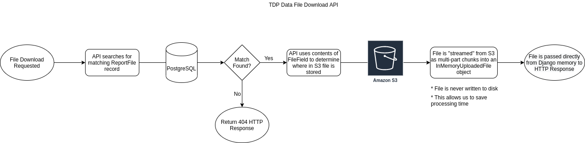

# Data Files Download Architecture

This application provides a secure means to both store and download files from
AWS S3 through the use of an open source Django plugin `django-storages`. By
utilizing built in Django classes in conjunction with this plugin we can enable
these files to be downloaded through an API endpoint without having to write
the files to the local storage of the server, thus removing a performance
penalty that would be incurred by essentially downloading the file twice.

## Process Flow

## S3 File Storage
`django-storages` provides a custom Storage Backend for Django that enables
storing files in S3 instead of on the local Django server. This application
has historically used this library for collection and storage of static files
served for the Django admin. However, with this change we will move towards
using this to interface with the Data Files as well.

### S3Boto3Storage
This storage backend provides the support for opening files in read or write
mode and supports streaming (buffering) data in chunks to S3 when writing.

[Source code](https://github.com/jschneier/django-storages/blob/master/storages/backends/s3boto3.py#L233)

### S3Boto3StorageFile
This class extends Django's File class to support file streaming using the
[boto3](https://boto3.amazonaws.com/v1/documentation/api/latest/index.html)
library's multipart uploading functionality. It provides a wrapper to access
the buffered file contents.

[Source code](https://github.com/jschneier/django-storages/blob/master/storages/backends/s3boto3.py#L79)

### InMemoryUploadedFile
This file class is provided by Django and represents a file that has been
uploaded into memory via streaming. The file returned by `django-storages` for
a given FileField associated with an S3 object will leverage the functionality
of this class to prevent needing to write the file to disk, resulting in a more
performant download experience.

[Source code](https://github.com/django/django/blob/main/django/core/files/uploadedfile.py#L78)

## ReportFile model
This is a custom model for the application that stores information about a
Data File that has been uploaded to the system. To leverage the features
mentioned above this model will have a [FileField](https://docs.djangoproject.com/en/3.2/ref/models/fields/#filefield)
on the model which is linked to S3 via `django-storages`. From the perspective
of the API, this will make downloading the file as simple as calling the `open`
method on the file property of a `ReportFile` instance.
