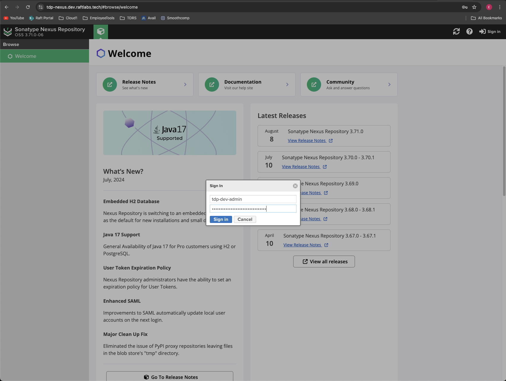

# Nexus Artifact Repository

We are using Nexus as an artifact store in order to retain docker images and other artifacts needed for our apps and pipelines.

Nexus UI can be accessed at [https://tdp-nexus.dev.raftlabs.tech/](https://tdp-nexus.dev.raftlabs.tech/)

## Nexus Image Management

### Host Information

The VM that runs the [Sonatype Nexus Image](https://help.sonatype.com/repomanager3/product-information/download) currently resides at 172.10.4.102 on Raft's internal network. You must first be connected to the labs.goraft.tech Raft Labs VPN before SSHing to the container. Current points of contact for getting setup with the VPN are Connor Meehan and Barak Stout.

### Nexus Container Setup

From our virtual machine, here is how to get Nexus up and running.
Pull and run nexus image:
```
docker pull sonatype/nexus3
docker volume create --name nexus-data
docker run -d -p 8081:8081 -p 8082:8082 -p 8083:8083 --name nexus -v nexus-data:/nexus-data sonatype/nexus3
```

wait for nexus to be running
```
docker logs -f nexus
```

The first time you need to log in as root, you will need the auto-generated admin password that is created upon initialization of the container.
exec into the container and get docker admin.password:
```
docker exec -it nexus /bin/bash
cat /nexus-data/admin.password
```

After logging in as root for the first time, you will be taken to a page to set a new password.

## Hosted Docker Repository

### Setup

In order to use Nexus as a Docker repository, the DNS for the repo needs to be able to terminate https. We are currently using cloudflare to do this.

When creating the repository (must be signed in with admin privileges), since the nexus server isn't actually terminating the https, select the HTTP repository connector. The port can be anything you assign, as long as the tool used to terminate the https connection forwards the traffic to that port.

In order to allow [Docker client login and connections](https://help.sonatype.com/repomanager3/nexus-repository-administration/formats/docker-registry/docker-authentication) you must set up the Docker Bearer Token Realm in Settings -> Security -> Realms -> and move the Docker Bearer Token Realm over to Active.
Also, any users will need nx-repository-view-docker-#{RepoName}-(browse && read) at a minimum and (add and edit) in order to push images.

We have a separate endpoint to connect specifically to the docker repository.
[https://tdp-docker.dev.raftlabs.tech](tdp-docker.dev.raftlabs.tech)

e.g.
```
docker login https://tdp-docker.dev.raftlabs.tech
```

### Pushing Images

Before an image can be pushed to the nexus repository, it must be tagged for that repo:

```
docker image tag ${ImageId} tdp-docker.dev.raftlabs.tech/${ImageName}:${Version}
```

then you can push:

```
docker push tdp-docker.dev.raftlabs.tech/${ImageName}:${Version}
```

### Pulling Images

We do not allow anonymous access on our Nexus instance. With that said, if you have not [logged in with Docker](#docker-login) you will not be able to pull. If you are logged in:

```
docker pull tdp-docker.dev.raftlabs.tech/${ImageName}:${Version}
```

## Nexus Administration

### UI Admin Login
To administer Nexus via the UI, you will need to access the service key in our dev cloud.gov environment.

Log in with CloudFoundry
```
cf login --sso
```
Be sure to specify the space as `tanf-dev`

After you've authenticated you can grab the password from the key:
```
cf service-key tanf-keys nexus-dev-admin
```

The key returns a username and a password:
```
{
  "credentials": {
    "password": REDACTED,
    "username": REDACTED
  }
}
```
Copy the `password` to your clipboard and login into the Nexus UI with the `tdp-dev-admin` user. See below:



### VM Login
To access the VM running Nexus, you will need to gain access to the Raft internal network. To do this, you will need to install CloudFlare's WARP zero trust VPN. Follow the instructions [here](https://gorafttech-my.sharepoint.com/:w:/g/personal/tradin_teamraft_com/EZePOTv0dbdBguHITcoXQF0Bd5JAcqeLsJTlEOktTfIXHA?e=34WqB4) to get setup. From there, reach out to Eric Lipe or Connor Meehan for the IP, username, and password to access the VM. Once you have the credentials, you can login with SSH:
```
ssh username@IP_Address
```

Once logged in, you can run `docker ps` or other docker commands to view and administer the Nexus container as necessary. You should also consider generating an ssh key to avoid having to enter the password each time you login. To do so, run the following commands on your local machine.
```
ssh-keygen
```

```
ssh-copy-id username@IP_Address
```
Now you will no longer have to enter the password when logging in.

## Local Docker Login
After logging into the `tanf-dev` space with the `cf` cli, execute the following commands to authenticate your local docker daemon
```
export NEXUS_DOCKER_PASSWORD=`cf service-key tanf-keys nexus-dev | tail -n +2 | jq .password`
echo "$NEXUS_DOCKER_PASSWORD" | docker login https://tdp-docker.dev.raftlabs.tech -u tdp-dev --password-stdin
```

Sometimes the `docker login...` command above doesn't work. If that happens, just copy the content of `NEXUS_DOCKER_PASSWORD` to your clipboard and paste it when prompted for the password after executing the command below.
```
docker login https://tdp-docker.dev.raftlabs.tech -u tdp-dev
```
