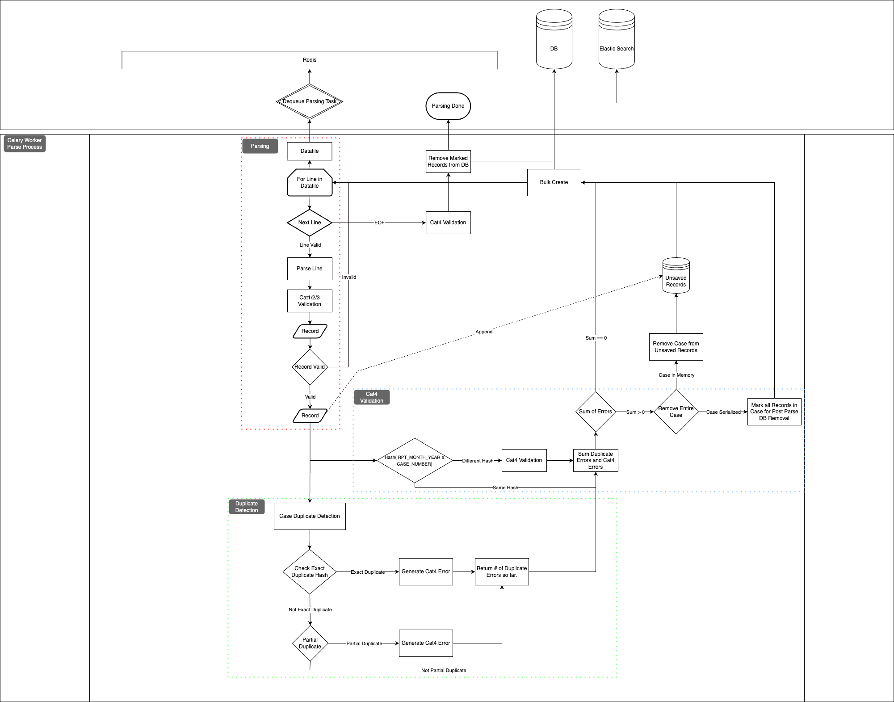

# High Level Parsing Flow

Parsing begins after a user submits a datafile or datafiles via the frontend. The submission generates a new Celery task
or tasks which are enqueued to Redis. As work becomes available the Celery workers dequeue a task from Redis and begin 
working them. The parsing task gets the Datafile Django model and begins iterating over each line in the file. For each 
line in the file this task: parses the line into a new record, performs category 1 - 3 validation on the record, 
performs exact duplicate and partial duplicate detection, performs category 4 validation, and stores the record in a 
cache to be bulk created/serialized to the database and ElasticSearch. The image below provides a high level flow of the
aforementioned steps.

