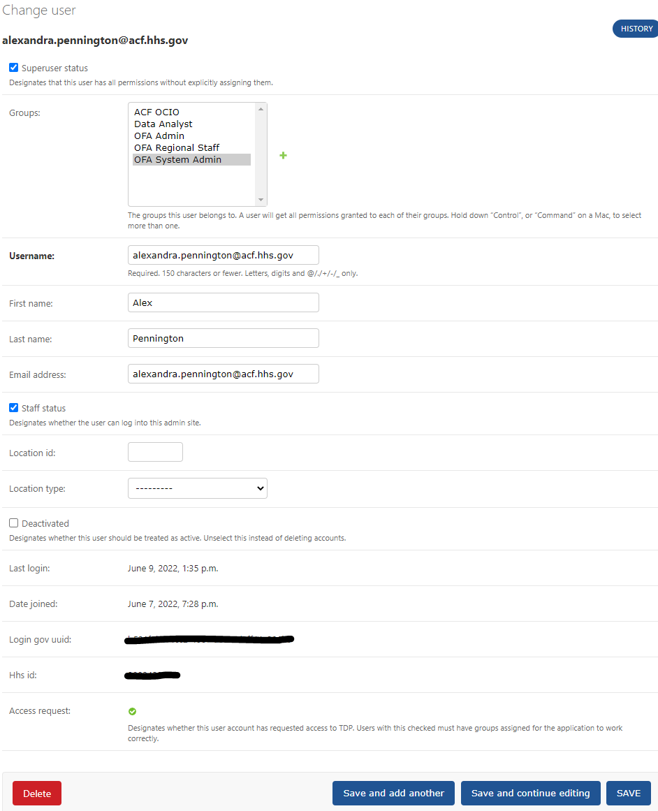

# User Role Management

## Updating User Roles through the Django Admin Interface

**Description**

TDP`System Admins` will be assigning and updating application user roles through the Django Admin Interface. This can be accessed via the backend at:

`<backend-domain-name>/admin/` (e.g. `https://tdp-backend-staging.app.cloud.gov/admin/`)

The admin interface requires special privileges which can only be granted via the Django CLI [detailed below](#cli) or a Django Data migration. Once a user has been granted privileges, they can go to the admin page described above and log in. The admin interface provides links to [Users](), [STTs](), [Regions](), submitted [Data files](), and Groups which
can each be modified through the interface.

### Log in to Admin

- Go to `<frontend-domain-name>` (e.g. `https://tdp-frontend-staging.app.cloud.gov/`)
- Sign in through `ACF AMS` (ACF users)
- Go to `<backend-domain-name>/admin/` (e.g. `https://tdp-backend-staging.app.cloud.gov/admin/`)

_Alternatively_

- Go to `<backend-domain-name>/admin/`
- You will be redirected to `<frontend-domain-name>` 
- After signing in ACF AMS credenials, you will be redirected back to the main application
- Go to `<backend-domain-name>/admin/`

### Admin Home

- The admin home page gives you access to all of the objects you can manage


### Group List

- Clicking on "Groups" from the Admin Home page gives you a list of all of the existing groups.
- Current groups listed are `OFA System Admin`, `OFA Admin` , `ACF OCIO`, `OFA Regional Staff`, and `Data Analyst`.


### Group Permissions

- When you click on a group in the Group List, you can add/update/remove permissions for each group.


### Region List

- When you click on "Regions" from the Admin Home page, you can view the regions currently in the system


### STT List

- When you click on "STTs" from the Admin Home page, you can view a list of the STTs currently in the system. 


- Note that STT attributes (e.g. type, STT code, etc.) cannot be modified via the Django Admin Interface.


### User List

- When you click on "Users" from the Admin Home page, you can see a list of users currently in the system.


### User Edit

- When you click on a user from the User List, you can edit that user's information, including
first name, last name, and username, as well as the user's Active Status, Superuser Status, Staff Status, assigned Groups, location ID and type (STT or region). You can also view the user's login.gov UUID (external users only), HHS ID (ACF users only), as well as the date and time the user joined and when they last logged in. Finally, the access_request field indicates if the user has submitted a request for access to TDP.




## <a id="cli"></a> Updating User Roles through the CLI

**Description**

For the OFA MVP, we will need to assign the Django built-in roles of `superuser` and `staff` to the deployed application.
This will be needed for users to have access to the Django Admin interface detailed above.

This guide will provide instructions on how to define them in local and deployed environments. 
Access to the CLI is strictly controlled by the Product Owner. 


**Local Development**
	
1a.) After following the instructions in the README for the TDRS Frontend and 
Backend services, you will now be able to login via Login.gov which will result in 
your account being generated and stored in the local database.

1b.) Alternatively, run the following commands from the root directory: 

  
   ```bash
   source commands.sh
   tdrs-django-shell
   ```
   This will open up a shell prompt that will allow you to execute commands 
   directly to the TDRS Backend Django application.
   
   To update your user, edit the sample script below to reflect your Login.gov 
   email associated with your login process and press enter.  After this you may 
   exit the shell and resume using the application with the `superuser` role. 
   
   ```
from django.contrib.auth import get_user_model
User = get_user_model()
user = User.objects.get(username="test@example.com")
user.is_superuser = True
user.save()
```

To assign the user to a custom role, like `Data Analyst` use the following

```
from django.contrib.auth.models import Group
from django.contrib.auth import get_user_model

data_prepper = Group.objects.get(name="Data Analyst")
User = get_user_model()
user = User.objects.get(username="test@example.com")
data_prepper.user_set.add(user)

```
 
 
 **Deployed Environment**
	
1.) Users targeted for Superuser creation will have to be manually elevated by system administrators with access to the intended Cloud.gov environment. 

2.) Admins with access will have to ssh into the environment and assign permissions. Instructions for how to do this are included [here](https://github.com/raft-tech/TANF-app/blob/develop/docs/Security-Compliance/Incidence-Response/Sys-Admin-Acct-Mgmt.md#example-mitigation-steps) under **CF CLI Commands**.

 