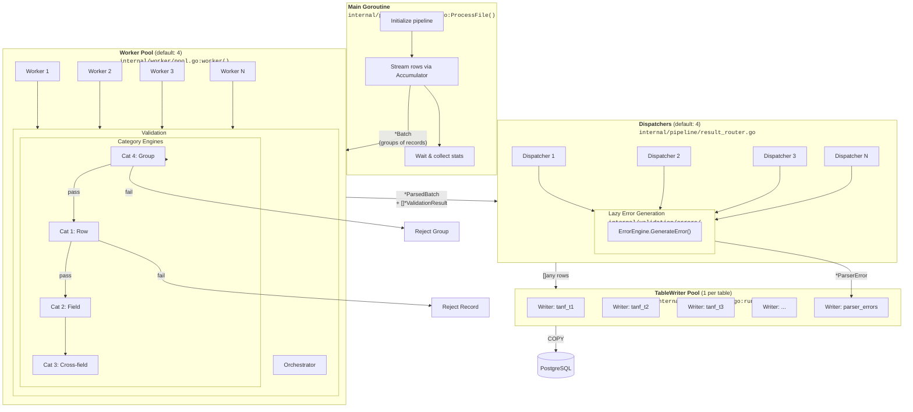
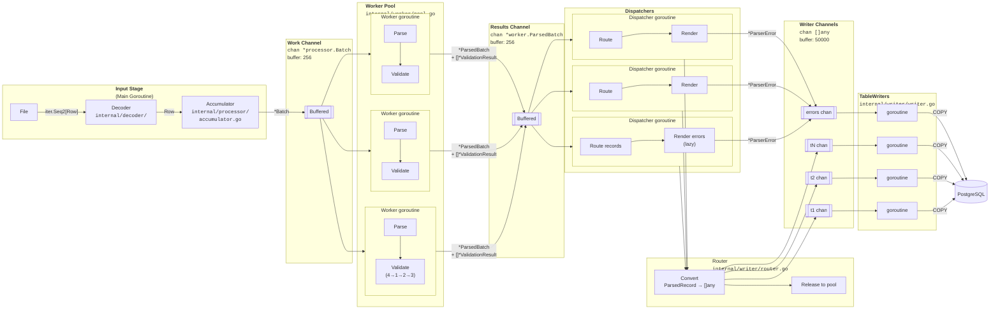

# Go Parser System Architecture Diagrams

Visual reference showing goroutine parallelism, channel communication, and the validation pipeline.

> **Code references** (e.g., `internal/pipeline/pipeline.go`) show where each component lives.

---

## 1. High-Level Goroutine Architecture

**Goroutine Count:** 1 (main) + N (workers) + N (dispatchers) + M (writers) = ~13+ total

**Key Points:**
- Workers parse AND validate (validation runs inside worker goroutines)
- Validation executes in order: Cat 4 → 1 → 2 → 3 with short-circuit on failure
- Error messages are rendered lazily by dispatchers (not during validation hot path)
- Each TableWriter runs in its own goroutine, including the error writer

---

## 2. Detailed Channel Flow

**Channel Buffer Sizes:**
| Channel | Type | Buffer | Purpose |
|---------|------|--------|---------|
| Work | `chan *Batch` | 256 | Backpressure on accumulator |
| Results | `chan *ParsedBatch` | 256 | Backpressure on workers |
| Writer | `chan []any` | 50000 | Batch before COPY |

**Data Flow:**
1. **Main goroutine** streams rows through Decoder → Accumulator
2. **Accumulator** groups by `key_fields`, emits `*Batch` to work channel
3. **Workers** (competing) parse fields, run validation (Cat 4→1→2→3), emit `*ParsedBatch` + `[]*ValidationResult`
4. **Dispatchers** (competing) route valid records to table writers, render errors lazily
5. **TableWriters** buffer rows, flush via PostgreSQL COPY at threshold

**Validation Integration:**
- Validation runs inside workers (same goroutine as parsing)
- `ValidationResult` stores pointers (not rendered messages) — ~80 bytes each
- Error rendering happens in dispatchers via `ErrorEngine.GenerateError(result)`
- Rendered `*ParserError` sent to dedicated error writer channel
