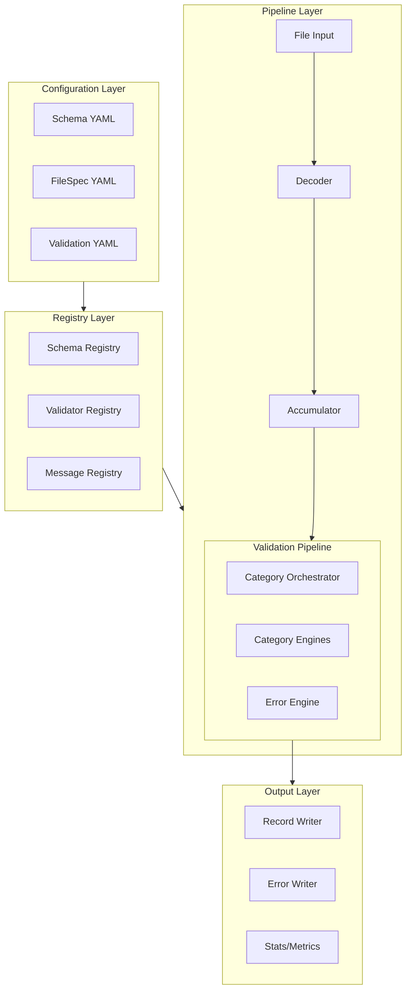
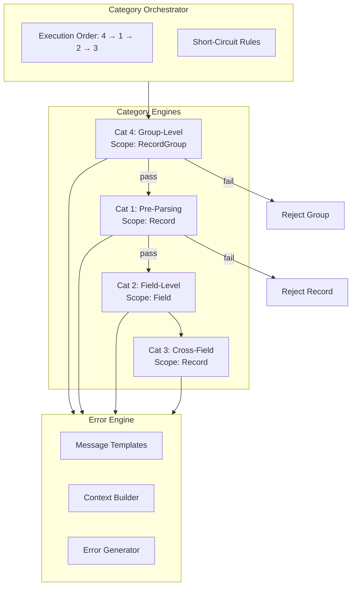
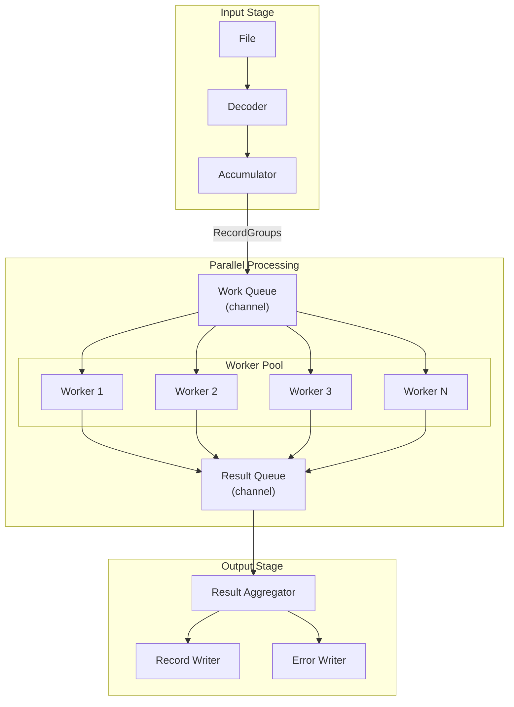
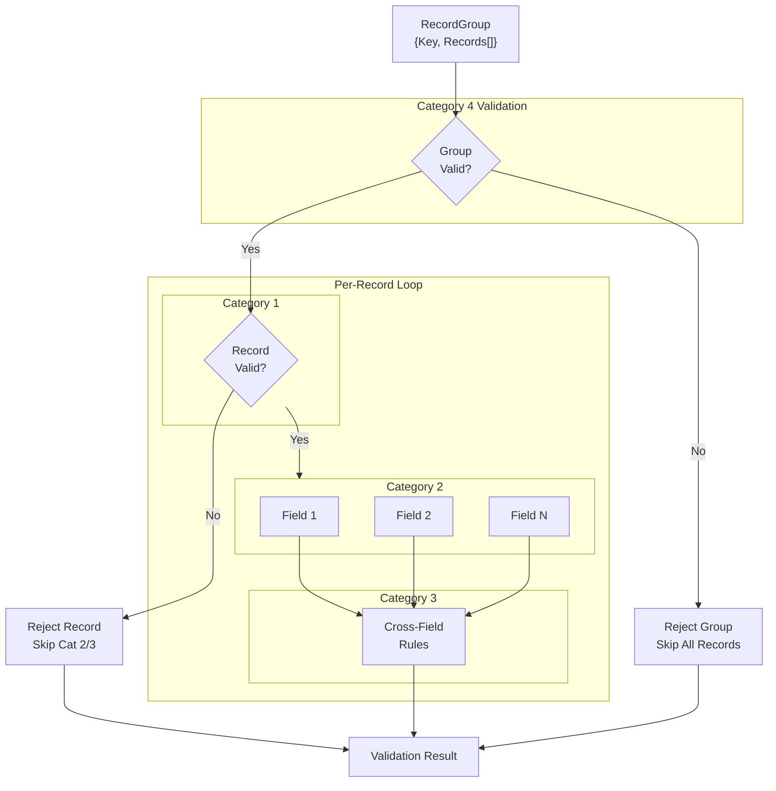
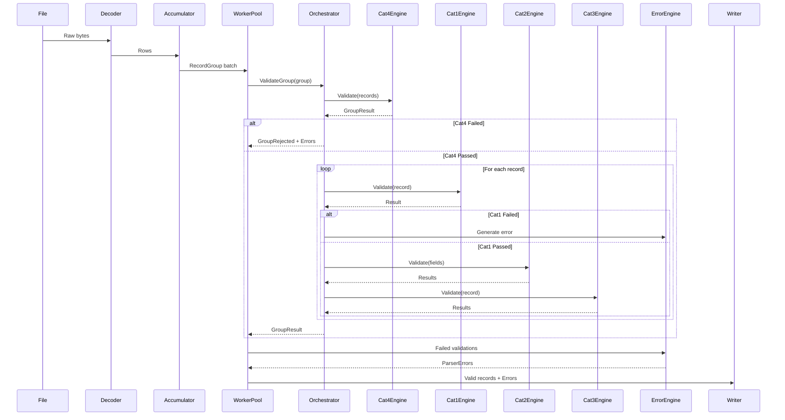
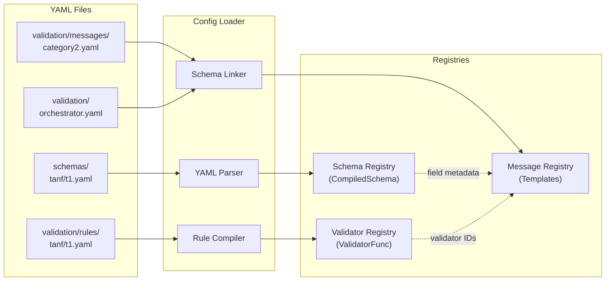
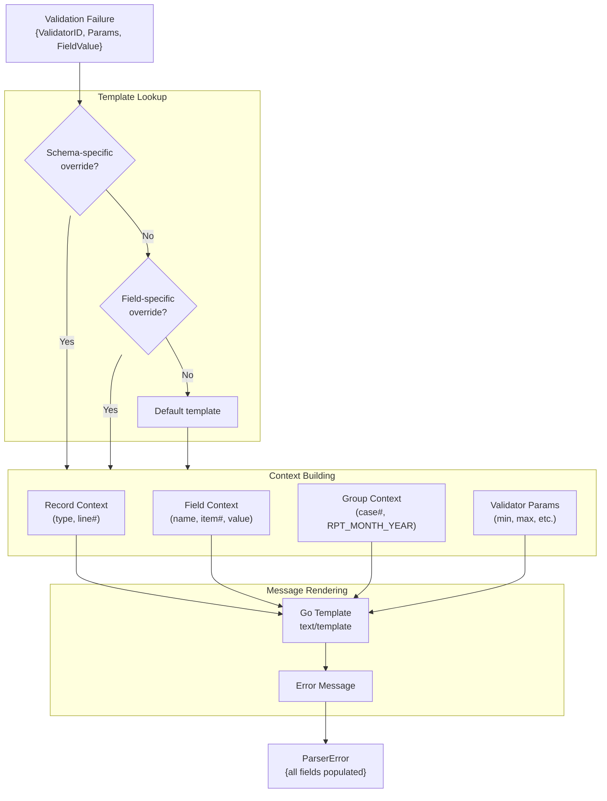
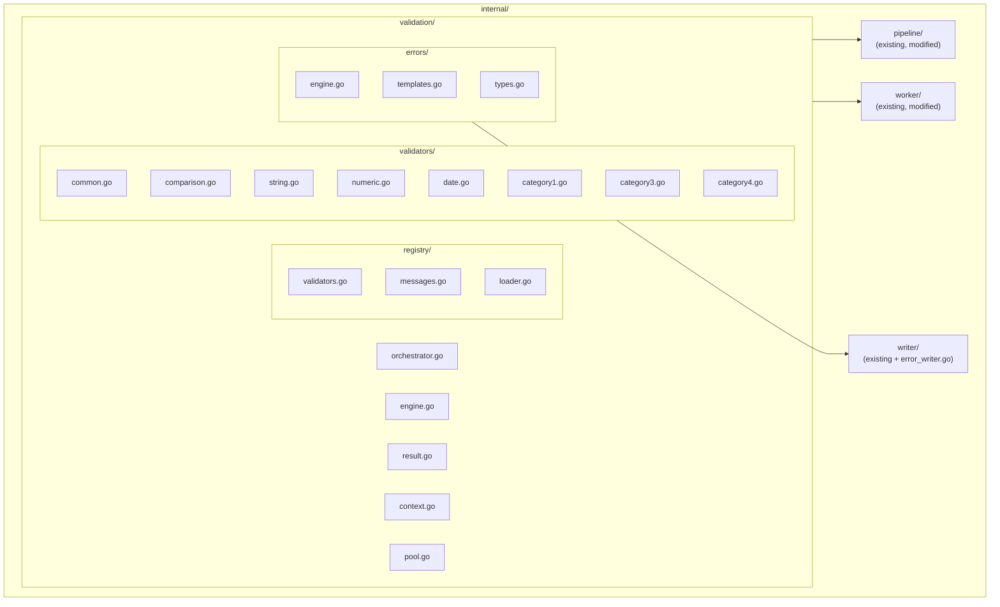
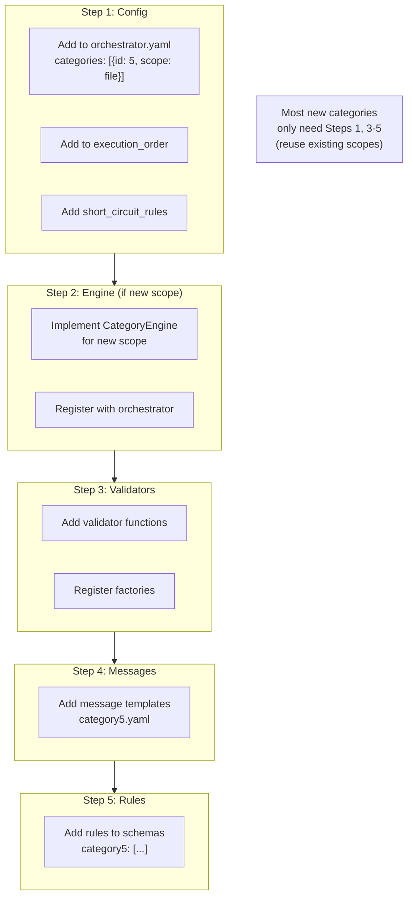
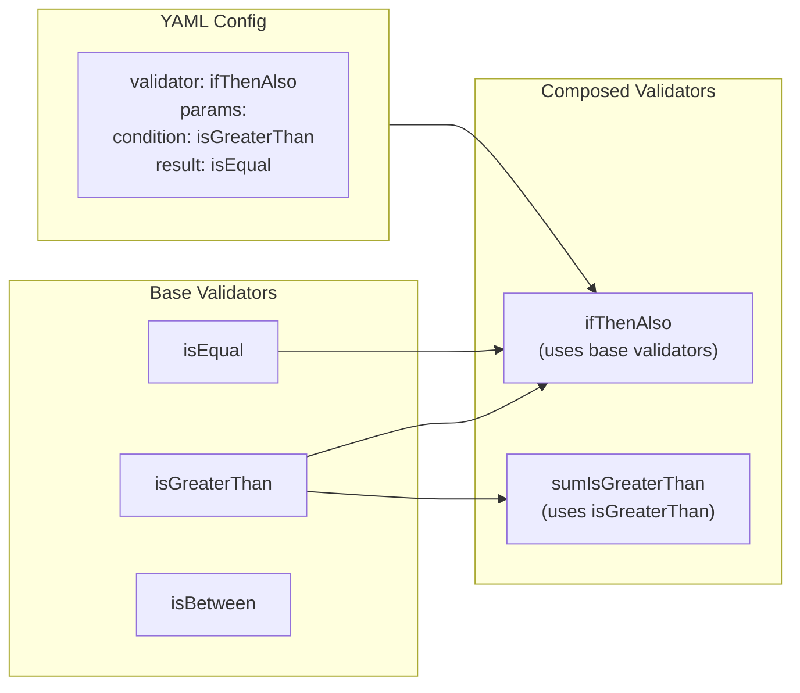

# Validation Architecture Diagrams (Mermaid)

## 1. High-Level System Architecture

## 2. Validation Pipeline Detail

## 3. Concurrency Model

## 4. Within-Worker Validation Flow

## 5. Data Flow Sequence

## 6. Configuration Loading

## 7. Error Generation Flow

## 8. Package Structure

## 9. Adding a New Category

## 10. Validator Composition

