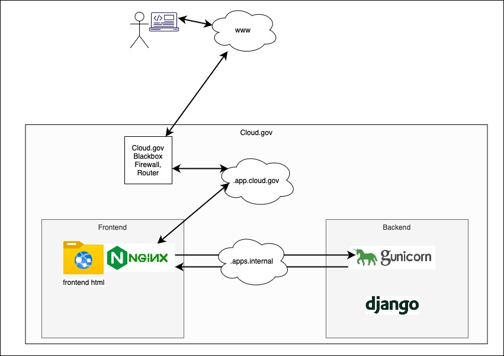

# Nginx Documentation

## 1. Installation

The Nginx uses a master process and mutiple workers to efficiently manage requests. The master process reads and evaluates config file and manages the workers.

In TDP, all config and associated files with it are placed in ```/tdrs-frontend/nginx``` folder. There are various differences between the local and deployed versions. Due to the fact that cloud.gov uses buildpacks and local version uses containerized docker instance, there are two separate directories for local and deployed versions.

## 2. Architecture

In general for TDP, the *Nginx* handles incoming HTTP requests to both frontend and backend. The frontend requests are handled directly while the backend requests are forwarded to the backend server.



*Nginx* serves the frontend built files placed in *```/usr/share/nginx/html```* which ensures not only the static files are served efficiently, the security headers area added as defined in the conf file.

- HTTP requests are first handled by Cloud.gov (.app.cloud.gov subnet) and then routed to frontend instance
- Nginx serves frontend requests directly and routes backend api requests to backend server.
- The backend requests are distinguished by their specific URI (e.g: addresses starting with ```/v1```) using location directive (see below).

```
location ^~ /v1/ {
        proxy_pass         http://{{env "BACKEND_HOST"}}.apps.internal:8080/v1/;
        proxy_set_header   Host $host;
        proxy_set_header   X-Real-IP         $remote_addr;
        proxy_set_header   X-Forwarded-For   $proxy_add_x_forwarded_for;
        proxy_set_header   X-Forwarded-Proto https;

        proxy_connect_timeout 60;
        proxy_send_timeout    60;
        proxy_buffer_size     4k;
        proxy_temp_file_write_size 64k;
}
```

The Nginx configuration files are located in: ```*'/frontend/nginx/'```*

### Dynamic locations
In cloud environments, DNS information for applications is in a state of constant flux. To avoid having to restart Nginx each time an app's DNS information changes, Nginx provides features to resolve a host after a TTL has expired. The http block and location block below demonstrate the config updates to support dynamic locations. Note the `...` in the blocks below represents other config options in the blocks that we don't need to worry about.

```
http {
    include mime.types;

    resolver 127.0.0.11 ipv6=off valid=5s;
    ...
}
```

```
location ~* ^/kibana/(.*)$ {
    auth_request /kibana_auth_check;
    auth_request_set $auth_status $upstream_status;

    set $kibana http://${KIBANA}:5601/;
    proxy_pass $kibana$1$is_args$args;
    ...
}
```

In the `http` block we need to include the `resolver` directive. This tells Nginx where our desired nameserver is and any other options we want to configure, such as the TTL option.
The configuration above indicates the nameserver is at `127.0.0.11`, ipv6 is disabled, and the TTL for a hostname is five seconds. However, for Nginx to re-resolve a host
we have to update the location, i.e. the `proxy_pass` in the location to use variable resolution. When Nginx resolves the variable given to the `proxy_pass` directive it will also determine if the TTL has expired for the host that the variable resolves to and will then resolve the DNS info if it has expired. If `proxy_pass` is not given a variable, Nginx will never resolve the host given to the `proxy_pass` directive no matter how short the TTL option is.


## 3. Backend

### Nginx

The frontend then sends processing requests to the *backend* Django server, which are handled by *[gunicorn](https://gunicorn.org)*. See section below [Gunicorn](###Gunicorn).

### Gunicorn

Gunicorn is WSGI HTTP server based on python and uses **worker [Worker Processes](https://docs.gunicorn.org/en/stable/design.html#choosing-a-worker-type)**. The number of workers is relative to server request load.

With having workers responding to requests in Gunicorn, it is importnat to have Nginx in front to handle requests first, otherwise DDOS attacks would consume the server (See Nginx config).

Gunicorn by default uses **[Sync worker](https://docs.gunicorn.org/en/latest/design.html#sync-workers)**. This is the most basic worker with some implications. Sync does not support persistent connections, which is the case in our application.
```python
# The number of worker processes for handling requests
workers = 2
```

There are two config files: one for development and one for deployed applications. Gunicorn is started from ```gunicorn_start.sh``` which starts either version of config files based on environment.

## 4. Security

### Whitelist IPs
A list of IP addresses has been added to ```ip_whitelist.conf```. This means any request from an ip address not in the subnets included in this file will be rejected. This list is created manually and needs to be maintained to whitelist and include user IP subnets.

### Security Headers
All security headers are following best practices from [Mozilla](https://developer.mozilla.org/en-US/docs/Web/HTTP/Headers) and [OWASP](https://owasp.org/www-project-secure-headers/) and are added with comments on the config files.

### CORS

Cross-Origin Resource Sharing (CORS) header allows a server to indicate any origin such as domain or port other than its own from which a browser can load resources. By adding HTTP headers that let server know which origins are permitted to read that information from the web browser. It should be noted that request might be passed without implications on CORS, this includes most form requests.

Since the frontend has to send requests to the backend server, the security headers are being set when serving the frontend requests as well as when Nginx acts as proxy server for the backend API. This is to ensure the sercurity headers cannot be tampered with and are always set to the correct values.

The backend server then checks the request origin and verifies the request against existing whitelisted origins. The backend uses [django-cors-headers](https://github.com/adamchainz/django-cors-headers) to verify and add CORS headers which consiquesntly allow the response to be accessed on other domains. The list of accepted domains are defined in settings file using ```CORS_ALLOWED_ORIGINS```.

### CSP Headers
CSP headers are added in the following block:

```
set $CSP "default-src 'none';";
set $CSP "${CSP}script-src 'self';";
set $CSP "${CSP}style-src 'self' 'unsafe-inline';";
...
set $CSP "${CSP}style-src-elem 'self';";
set $CSP "${CSP}style-src-attr 'none';";
set $CSP "${CSP}worker-src 'none';";
add_header Content-Security-Policy $CSP;
```

The ```default-src``` header sets all the CSP headers to a default value. Any of the CSP headers then can override the default value. As an example, in the above config default value is set to 'none', however ```script-src``` is set to self which means scripts from the same source are secure to run and can be accepted.
