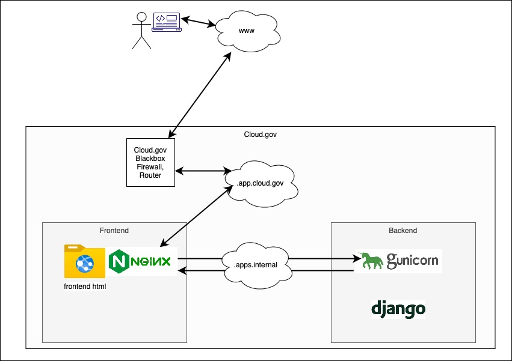

# Nginx Documentation

## 1. Installation

The Nginx uses a master process and mutiple workers to efficiently manage requests. The master process reads and evaluates config file and manages the workers.

In TDP, all config and associated files with it are placed in ```/tdrs-frontend/nginx``` folder. There are various differences between the local and deployed versions. Due to the fact that cloud.gov uses buildpacks and local version uses containerized docker instance, there are two separate directories for local and deployed versions.

## 2. Architecture

In general for TDP, the *Nginx* handles incoming HTTP requests to both frontend and backend. The frontend requests are handled directly while the backend requests are forwarded to the backend server.



*Nginx* serves the frontend built files placed in *```/usr/share/nginx/html```* which ensures not only the static files are served efficiently, the security headers area added as defined in the conf file.

- HTTP requests are first handled by Cloud.gov (.app.cloud.gov subnet) and then routed to frontend instance
- Nginx serves frontend requests directly and routes backend api requests to backend server.
- The backend requests are distinguished by their specific URI (e.g: addresses starting with ```/v1```) using location directive (see below).

```
location ^~ /v1/ {
        proxy_pass         http://{{env "BACKEND_HOST"}}.apps.internal:8080/v1/;
        proxy_set_header   Host $host;
        proxy_set_header   X-Real-IP         $remote_addr;
        proxy_set_header   X-Forwarded-For   $proxy_add_x_forwarded_for;
        proxy_set_header   X-Forwarded-Proto https;

        proxy_connect_timeout 60;
        proxy_send_timeout    60;
        proxy_buffer_size     4k;
        proxy_temp_file_write_size 64k;
}
```

The Nginx configuration files are located in: ```*'/frontend/nginx/'```*

### Dynamic locations
In cloud environments, DNS information for applications is in a state of constant flux. To avoid having to restart Nginx each time an app's DNS information changes, Nginx provides features to resolve a host after a TTL has expired. The http block and location block below demonstrate the config updates to support dynamic locations. Note the `...` in the blocks below represents other config options in the blocks that we don't need to worry about.

```
http {
    include mime.types;

    resolver 127.0.0.11 ipv6=off valid=5s;
    ...
}
```

In the `http` block we need to include the `resolver` directive. This tells Nginx where our desired nameserver is and any other options we want to configure, such as the TTL option.
The configuration above indicates the nameserver is at `127.0.0.11`, ipv6 is disabled, and the TTL for a hostname is five seconds. However, for Nginx to re-resolve a host
we have to update the location, i.e. the `proxy_pass` in the location to use variable resolution. When Nginx resolves the variable given to the `proxy_pass` directive it will also determine if the TTL has expired for the host that the variable resolves to and will then resolve the DNS info if it has expired. If `proxy_pass` is not given a variable, Nginx will never resolve the host given to the `proxy_pass` directive no matter how short the TTL option is.


## 3. Backend

### Nginx

The frontend then sends processing requests to the *backend* Django server, which are handled by *[gunicorn](https://gunicorn.org)*. See section below [Gunicorn](###Gunicorn).

### Gunicorn

Gunicorn is WSGI HTTP server based on python and uses **worker [Worker Processes](https://docs.gunicorn.org/en/stable/design.html#choosing-a-worker-type)**. The number of workers is relative to server request load.

With having workers responding to requests in Gunicorn, it is importnat to have Nginx in front to handle requests first, otherwise DDOS attacks would consume the server (See Nginx config).

Gunicorn by default uses **[Sync worker](https://docs.gunicorn.org/en/latest/design.html#sync-workers)**. This is the most basic worker with some implications. Sync does not support persistent connections, which is the case in our application.
```python
# The number of worker processes for handling requests
workers = 2
```

There are two config files: one for development and one for deployed applications. Gunicorn is started from ```gunicorn_start.sh``` which starts either version of config files based on environment.

## 4. Security

### Whitelist IPs
A list of IP addresses has been added to ```ip_whitelist.conf```. This means any request from an ip address not in the subnets included in this file will be rejected. This list is created manually and needs to be maintained to whitelist and include user IP subnets.

### Non-production Basic Auth
Non-production cloud.gov frontend deployments require Nginx basic auth. Production deployments copy an empty ```basic_auth.conf```, so production remains publicly accessible.

The deploy script generates ```deployment/.htpasswd``` from the ```FRONTEND_BASIC_AUTH_USERNAME``` and ```FRONTEND_BASIC_AUTH_PASSWORD``` environment variables for any frontend deployment outside ```tanf-prod```. The develop Cypress deployment test uses the same credentials to authenticate against the protected frontend.

To rotate the shared non-production password, update those CI secrets and redeploy the affected non-production frontend environments.

### Security Headers
The deployed frontend adds CSP, HSTS, COOP, Permissions Policy, Referrer Policy, X-Content-Type-Options, and X-Frame-Options headers to frontend responses, including error responses. These headers follow guidance from [MDN](https://developer.mozilla.org/en-US/docs/Web/HTTP/Headers) and [OWASP](https://owasp.org/www-project-secure-headers/).

Cross-Origin-Embedder-Policy is intentionally not enabled in the deployed frontend. The AWS WAF challenge is loaded from a cross-origin, dynamically generated script, and `require-corp` can block that challenge unless every resource opts into compatible CORS or CORP behavior. Reassess COEP if the WAF integration changes.

### CORS

Frontend HTML and static resources do not support cross-origin reads and therefore do not emit CORS response headers. The React application reaches the API through the same public Nginx hostname, so normal frontend API traffic does not require CORS.

Django is the source of truth for API CORS policy. Nginx forwards the request `Origin` to the backend without adding or replacing API CORS response headers. The backend uses [django-cors-headers](https://github.com/adamchainz/django-cors-headers) and the explicit HTTPS origins in `CORS_ALLOWED_ORIGINS` to decide whether a cross-origin client may read a response.

AWS WAF challenge resources under `*.token.awswaf.com` are generated and hosted by AWS rather than this application. ZAP excludes that vendor hostname from application scanning, while all `*.tanfdata.acf.hhs.gov` responses remain in scope.

### CSP Headers
CSP headers are added in the following block:

```
set $CSP "default-src 'none';";
set $CSP "${CSP}script-src 'self';";
set $CSP "${CSP}style-src 'self' 'unsafe-inline';";
...
set $CSP "${CSP}style-src-elem 'self';";
set $CSP "${CSP}style-src-attr 'none';";
set $CSP "${CSP}worker-src 'none';";
add_header Content-Security-Policy $CSP always;
```

The ```default-src``` header sets all the CSP headers to a default value. Any of the CSP headers then can override the default value. As an example, in the above config default value is set to 'none', however ```script-src``` is set to self which means scripts from the same source are secure to run and can be accepted.
